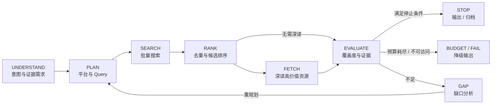
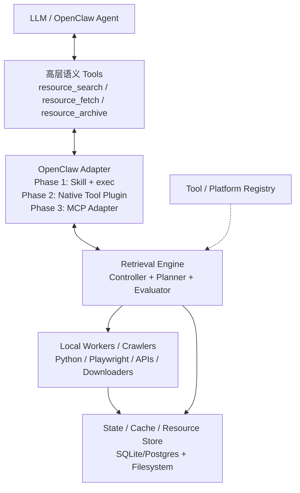

# Resource Retrieval Agent：资源检索智能体系统设计与实现方案

> OpenClaw + 本地搜索/爬虫工具 · Intent → Plan → Search → Evaluate → Fetch → Archive

> 本 Markdown 为独立文件；原 DOCX 中的三张架构图已转换为 Mermaid，因此无需额外图片资源。

> **文档定位**
>
> 本文不是“爬虫脚本使用说明”，而是一份完整的资源检索系统方案。系统目标是把用户自然语言中的资源需求转换成可执行、可评估、可迭代的检索任务，并在多个平台之间自动规划搜索、筛选候选、决定何时深读网页、判断何时搜索充分，最终将高价值资源获取、清洗并归档。

版本：v1.0  ·  日期：2026-08-07

# 目录与阅读路径

- 1. 项目背景与问题定义

- 2. 系统目标、边界与设计原则

- 3. 总体架构

- 4. 核心决策机制：谁来判断、依据什么判断

- 5. 核心数据模型与契约

- 6. Intent Analyzer：理解用户真正想找什么

- 7. Platform Router：决定去哪些平台

- 8. Search Planner：决定搜什么、如何搜、搜多少

- 9. Search Executor：多平台搜索执行层

- 10. Result Normalizer / Ranker：结果统一、去重与排序

- 11. Fetch Gate：什么时候必须进入网页

- 12. Fetch / Extract：网页、项目与文件获取

- 13. Evidence Evaluator：怎么判断结果好不好、够不够

- 14. Retrieval Controller：状态机、预算与停止条件

- 15. OpenClaw 集成与本地工具接入

- 16. 工程目录、接口与伪代码

- 17. 安全、权限、可观测性与异常恢复

- 18. 测试、评估指标与验收标准

- 19. 分阶段实施路线

- 20. 三个完整运行示例

- 附录 A. 推荐配置

- 附录 B. 核心 JSON Schema 示例

- 附录 C. OpenClaw 官方参考资料

> **建议先读**
>
> 如果你准备直接开始实现，优先阅读第 3、4、5、14、15、16、19 章；如果你更关心“为什么系统能搜得全面且准确”，重点读第 6—13 章。

# 1. 项目背景与问题定义

当前已有能力是一批本地搜索、抓取、下载、网页解析脚本。它们解决的是“已知该调用哪个工具后，如何执行”的问题，但尚未解决更前置、更决定搜索质量的问题：用户说一句自然语言后，系统如何判断真正的资源目标、选择最合适的平台、为不同平台生成不同的搜索词、动态决定搜索深度、判断哪些候选值得进入网页、以及什么时候可以停止。

因此，本项目要建设的不是一个“多平台爬虫集合”，而是一个 Resource Retrieval Agent / Engine：它将搜索工具组织成一个闭环检索系统。

| 现有脚本解决的问题 | 系统仍缺失的问题 |
| --- | --- |
| 能搜索 GitHub / Web / 社区平台 | 不知道用户当前应该先搜哪个平台 |
| 能抓取网页 HTML / API | 不知道搜索摘要是否已足够，还是必须进入网页 |
| 能下载 PDF / 图片 / 文件 | 不知道哪些资源值得下载和归档 |
| 能返回一批结果 | 不知道结果是否相关、权威、新鲜、重复 |
| 能执行固定 query | 不会按平台特性生成 query，也不会根据结果重规划 |
| 能执行 N 条搜索 | 不知道 N 是否合理，也不知道什么时候应该停止 |

> **核心命题**
>
> 爬虫决定“能不能搜”，检索规划与评估决定“搜得好不好”。因此系统最重要的能力不是继续堆爬虫，而是建立 Planner → Search → Evaluate → Replan 的闭环。

# 2. 系统目标、边界与设计原则

## 2.1 系统目标

- 把用户自然语言转成结构化 Retrieval Intent：主题、目标资源类型、用途、约束、质量偏好、必须回答的问题。

- 依据资源类型与平台能力矩阵，动态选择搜索平台，而不是把所有平台都搜一遍。

- 为不同平台生成平台化 Query，例如 GitHub、通用 Web、官方站点、社区、视频、学术搜索分别使用不同表达。

- 用批次化、迭代式搜索替代“一次生成几十个 query 全部执行”。

- 把搜索结果先作为候选资源，再通过去重、排序、深读与证据评估形成高质量结果集。

- 通过覆盖度、证据质量、信息增益、预算等信号判断继续搜索、换词、换平台、深读还是停止。

- 将高价值结果交给后续 Fetch / Extract / Archive 管线，实现网页、文档、图片、项目等统一归档。

## 2.2 非目标

- 不让 LLM 直接获得无限制 shell 权限并随意执行任意爬虫。

- 不把每个爬虫脚本都直接暴露成一个模型 Tool。

- 不依赖“搜满 20 条就结束”这类静态数量规则。

- 不把搜索引擎摘要直接当作最终事实证据。

- 不把 OpenClaw 与检索核心强耦合；检索引擎应可独立测试与复用。

## 2.3 设计原则

| 原则 | 说明 |
| --- | --- |
| LLM 做模糊判断 | 意图理解、资源分类、Query 生成、语义相关性、证据缺口分析。 |
| 代码做确定控制 | 状态机、预算、超时、并发、Schema 校验、去重、缓存、停止规则。 |
| 先宽搜，再窄读 | Search 负责发现；Fetch 只深读高价值候选。 |
| 按证据覆盖停止 | 是否结束由问题覆盖和证据质量决定，而非固定结果数。 |
| 平台能力显式化 | 维护 Platform Registry，让平台选择可解释、可配置。 |
| 数据契约优先 | Intent、SearchPlan、Candidate、Evidence、State 都使用严格 Schema。 |
| OpenClaw 只做适配 | 核心 Retrieval Engine 保持独立，便于未来接 MCP、Codex、其他 Agent。 |

# 3. 总体架构

推荐采用“Agent 外壳 + Retrieval Engine 核心 + Local Tool Workers”的三层架构。OpenClaw 负责会话、模型、Skills 与 Tool 暴露；Retrieval Engine 负责检索闭环；底层 Workers 负责具体搜索、抓取和下载。

```mermaid
flowchart LR
    U["用户请求"] --> OC["OpenClaw Agent<br/>会话 / Skill / Tool"]
    OC --> RC["Retrieval Controller<br/>状态 / 预算 / 停止条件"]
    RC --> IA["Intent Analyzer<br/>意图 / 问题拆解"]
    IA --> SP["Search Planner<br/>平台 / Query / 批次"]
    PR["Platform Registry<br/>能力 / 成本 / 限制"] -.-> SP
    SP --> SE["Search Executor<br/>确定性执行"]
    SE --> PL["Web / 官方 / GitHub / 社区 / 视频 / 学术"]
    PL --> ND["Normalizer + Dedup<br/>统一候选"]
    ND --> CR["Candidate Ranker<br/>相关 / 权威 / 新鲜 / 质量"]
    CR --> FG["Fetch Gate<br/>是否深读"]
    FG -->|深读| FC["Fetcher / Crawlers<br/>HTML / API / Browser / File"]
    FG -->|摘要足够| EE["Evidence Evaluator + Gap<br/>覆盖 / 证据 / 信息增益"]
    FC --> EE
    EE -->|不足：补搜| RC
    EE -->|需保存| AR["Extract / Archive<br/>正文 / 图片 / 附件 / 元数据"]
    EE -->|足够| R["结果返回"]
    AR --> R
```



> 图 1  总体架构：模型不直接控制爬虫，Controller 维护检索状态并调用规划、执行、评估模块。

## 3.1 智能层与确定性层

| 模块 | 建议实现 | 原因 |
| --- | --- | --- |
| Intent Analyzer | LLM + JSON Schema | 需要理解自然语言、隐含需求与资源用途。 |
| Resource Classifier | LLM / 小模型 | 资源类型与检索目标是语义判断。 |
| Platform Router | 规则/矩阵 + LLM 排序 | 平台能力应显式配置，模型只做上下文调整。 |
| Query Planner | LLM | 适合做同义扩展、平台化表达、约束转写。 |
| Search Executor | 代码 | 必须稳定、可并发、可重试、可计量。 |
| Normalizer / Dedup | 代码 + embedding 可选 | 结构标准化与 URL/内容去重适合程序化。 |
| Semantic Ranker | 规则 + LLM/重排模型 | 结合客观信号与语义相关性。 |
| Fetch Gate | 规则优先 + LLM补充 | 大部分深读条件可以明确规则化。 |
| Evidence Evaluator | LLM + 规则 | 需要判断是否回答了问题、是否有冲突与缺口。 |
| Retrieval Controller | 代码状态机 | 不能让模型自行决定无限循环和预算。 |

# 4. 核心决策机制：谁来判断、依据什么判断

系统中的关键决策可以统一理解为：LLM 输出“判断结果和理由”，Controller 根据结构化判断、规则和预算选择下一动作。模型不是流程控制器。

| 决策 | 主要判断者 | 客观输入 | 输出动作 |
| --- | --- | --- | --- |
| 用户想找什么 | Intent Analyzer (LLM) | 原始请求、会话上下文 | RetrievalIntent |
| 哪些平台相关 | Platform Router | 资源类型 + Platform Registry | 平台候选与优先级 |
| 每个平台搜什么 | Query Planner (LLM) | Intent + 平台能力 | SearchPlan |
| 搜索结果好不好 | Ranker + Evaluator | 摘要、域名、日期、统计信息、正文 | ResourceScore / Evidence |
| 要不要进入网页 | Fetch Gate | snippet充分度、来源类型、验证需求、用户动作 | fetch / skip |
| 要不要继续搜索 | Evaluator + Controller | Coverage、Gap、Information Gain、Budget | replan / stop |
| 要不要换平台/换词 | Gap Analyzer (LLM) | 未覆盖问题、失败原因、历史 query | 补搜计划 |

## 4.1 决策的统一形式

```text
Decision = Semantic Judgment + Objective Signals + Policy Constraints

Semantic Judgment: 相关吗？是否真正回答问题？还缺什么？
Objective Signals: 域名、发布日期、Stars、更新频率、重复率、响应状态等
Policy Constraints: 最大轮次、最大 Query、最大 Fetch、平台 allowlist、超时、成本
```

> **实施要求**
>
> 所有 LLM 决策都必须输出结构化 JSON，并通过 JSON Schema / Pydantic 校验。校验失败时自动重试一次；再次失败则使用规则化降级策略，而不是让后续代码猜字段。

# 5. 核心数据模型与契约

系统稳定性的关键不是 Prompt 本身，而是模块之间的契约。建议优先固定以下 7 类对象。

| 对象 | 作用 | 主要字段 |
| --- | --- | --- |
| RetrievalIntent | 定义任务到底是什么 | topic, goal, resource_types, constraints, questions_to_answer |
| PlatformProfile | 描述平台能做什么 | capabilities, content_types, cost, freshness, auth, limits |
| SearchPlan | 描述一轮准备怎么搜 | round, searches[], budget_request, rationale |
| CandidateResource | 统一搜索候选 | url, title, snippet, source, platform, date, metrics |
| FetchedResource | 深读后的资源实体 | metadata, content, assets, provenance |
| EvidenceItem | 证据与问题的映射 | question_id, resource_id, claim, strength, conflicts |
| RetrievalState | 整个任务状态 | history, candidates, fetched, coverage, gaps, budget |

## 5.1 RetrievalIntent 示例

```json
{
  "task_type": "resource_search",
  "topic": "Claude Code Skill Creator",
  "goal": "find_and_compare",
  "resource_types": ["official_documentation", "open_source_project"],
  "constraints": {
    "official_preferred": true,
    "open_source": true,
    "maturity_preferred": true,
    "language": ["zh-CN", "en"]
  },
  "questions_to_answer": [
    {"id": "q1", "question": "官方是否存在该能力？", "critical": true},
    {"id": "q2", "question": "官方入口或仓库在哪里？", "critical": true},
    {"id": "q3", "question": "有哪些成熟社区实现？", "critical": false}
  ]
}
```

## 5.2 CandidateResource 统一结构

```json
{
  "id": "cand_xxx",
  "url": "https://...",
  "canonical_url": "https://...",
  "title": "...",
  "snippet": "...",
  "platform": "github",
  "source_type": "repository",
  "published_at": null,
  "updated_at": "2026-08-01",
  "metrics": {"stars": 3200, "forks": 180},
  "query_ids": ["q_github_1"],
  "scores": {},
  "fetch_status": "not_fetched"
}
```

# 6. Intent Analyzer：理解用户真正想找什么

Intent Analyzer 的目标不是“给用户问题打一个分类标签”，而是生成后续搜索可执行的任务说明。需要显式抽取以下维度。

| 维度 | 典型值 | 对后续的影响 |
| --- | --- | --- |
| 目标对象 | 项目 / 文档 / 教程 / 论文 / 视频 / 数据集 / 图片 / 网页 / 文件 | 决定资源类型和平台。 |
| 动作目标 | 了解 / 查证 / 比较 / 寻找 / 下载 / 保存 / 归档 | 决定是否必须 Fetch、是否需要原始文件。 |
| 权威性要求 | 官方优先 / 社区实践 / 用户口碑 | 影响来源优先级。 |
| 时效要求 | 最新 / 历史 / 指定时间段 | 影响 Query、排序和 freshness 权重。 |
| 质量要求 | 成熟 / 高质量 / 全面 / 入门 / 深度 | 影响搜索深度和评价指标。 |
| 语言与地域 | 中文 / 英文 / 特定地区 | 影响平台和 query 语言。 |
| 数量倾向 | 一个最优 / 少量精选 / 尽量全面 | 影响停止条件和目标资源数。 |
| 必须回答的问题 | 若干可验证子问题 | 决定 Coverage Matrix。 |

## 6.1 问题拆解是停止判断的前提

如果没有 questions_to_answer，系统只能按“结果条数”停止；有了问题拆解，才能判断哪些关键问题已被证据覆盖、哪些仍缺失。例如“官方有没有 + 社区有没有成熟实现”天然是两个不同证据槽位，必须分别覆盖。

# 7. Platform Router：决定去哪些平台

不要让模型靠记忆自由猜平台。建议维护 Platform Capability Registry，将平台“擅长什么、成本如何、是否需要登录、能否返回结构化数据”等显式化。Router 先按资源类型筛选，再由 LLM 根据上下文调整优先级。

| 平台类别 | 适合资源 | 典型能力 | 默认优先场景 |
| --- | --- | --- | --- |
| 官方站 / 官方文档 | 产品文档、政策、版本、API | 高权威、第一手证据 | 查证“官方是否支持/发布/规定” |
| 通用 Web | 跨站发现、长尾页面 | 覆盖广、发现能力强 | 不知道资源在哪时先发现 |
| GitHub / 代码托管 | 开源项目、源码、Issue、Release | 代码与活跃度指标 | 找项目、实现、成熟度 |
| 社区问答/论坛 | 真实经验、排错、观点 | 用户经验丰富 | 查使用感受、坑、替代方案 |
| 视频平台 | 教程、演示、课程 | 多媒体资源 | 学习路径、操作演示 |
| 学术搜索 | 论文、数据集、引用 | 结构化学术元数据 | 研究、论文、方法比较 |
| 图书/资料目录 | 书籍、教材、出版物 | 书目元数据 | 寻找教材与出版资源 |

## 7.1 PlatformProfile 建议字段

```yaml
platform_id: github
capabilities: [source_code, repository, issue, release, developer_tool]
strengths: [maturity_signals, maintainer_activity, source_access]
weaknesses: [general_web_coverage]
auth_required: false
cost_weight: 1.0
rate_limit: ...
supported_filters: [language, updated_after, stars]
search_adapter: github_search
fetch_adapter: github_fetch
```

# 8. Search Planner：决定搜什么、如何搜、搜多少

Planner 的输出应是一轮 SearchPlan，而不是一次性生成整个任务所有 query。第一轮先执行信息量最高的一小批搜索，看到结果后再重规划。

## 8.1 平台化 Query Generation

| 平台 | 同一意图的 Query 形态 |
| --- | --- |
| 官方站 | 产品名 + 能力名；必要时限定官方域名。 |
| GitHub | 技术术语、仓库关键词、精确短语、owner/org、language、updated 等。 |
| 通用 Web | 自然语言概念 + alternative / official / guide；配合 site: 与时间约束。 |
| 社区 | 更接近用户真实表达，例如 experience / alternative / issue / worth it。 |
| 视频 | tutorial / demo / course / walkthrough + 技术名。 |
| 学术 | 正式术语、同义词、方法名、作者/会议/年份。 |

## 8.2 搜多少：预算而不是拍脑袋的固定数量

```yaml
budget:
  max_rounds: 4
  max_platforms_per_round: 4
  max_queries_total: 12
  max_results_per_query: 20
  max_candidates_total: 120
  max_fetch_total: 18
  wall_time_seconds: 90
```

模型可以提出 desired_results，但真正执行量必须由 Controller 取“模型请求量”和“系统预算”的较小值，并依据历史结果动态缩减或增加下一轮。

## 8.3 SearchPlan 示例

```json
{
  "round": 1,
  "searches": [
    {
      "platform": "official_web",
      "queries": ["Claude Code Skill Creator", "Claude Code skills"],
      "limit_each": 5,
      "purpose": ["q1", "q2"],
      "priority": 1
    },
    {
      "platform": "github",
      "queries": ["\"skill creator\" \"claude code\"", "anthropic claude skills"],
      "limit_each": 10,
      "purpose": ["q2", "q3"],
      "priority": 2
    }
  ]
}
```

# 9. Search Executor：多平台搜索执行层

Executor 不需要 LLM。它接收 SearchPlan，调用注册表里的 Search Adapter，并负责并发、重试、速率限制、缓存和原始结果落盘。

- 每个平台使用统一 search(query, limit, filters) 接口。

- 平台 adapter 自己处理 API、CLI、HTTP、浏览器自动化等差异。

- 所有结果进入 Normalizer 后再提供给上层，不让上层感知平台原始字段。

- 同一个 query + 参数应支持缓存，避免重规划时重复请求。

- 失败要区分：暂时网络错误、登录/权限、限流、无结果、解析失败、平台不可用。

```python
class SearchAdapter(Protocol):
    def search(self, query: str, limit: int, filters: dict) -> list[RawSearchResult]: ...

registry.register("github", GitHubSearchAdapter(...))
registry.register("web", WebSearchAdapter(...))
registry.register("zhihu", ZhihuSearchAdapter(...))
```

# 10. Result Normalizer / Ranker：结果统一、去重与排序

## 10.1 Normalizer

- URL canonicalization：去 tracking 参数、统一 http/https、处理重定向。

- 字段统一：title / snippet / source_type / published_at / updated_at / metrics。

- 来源记录：保存命中的 query_id、platform、rank，便于后续解释与调试。

- 初步去重：canonical URL、内容指纹、标题相似度。

- 跨平台聚合：例如同一 GitHub 仓库同时被 Web 搜索和 GitHub 搜索命中，应合并证据而非保留两条。

## 10.2 Candidate Ranking

建议把“客观信号”和“语义信号”组合，而不是全部交给模型。可使用如下初始评分框架，后续通过测试集调整权重：

```text
ResourceScore =
  0.35 * semantic_relevance
+ 0.20 * authority
+ 0.15 * freshness
+ 0.15 * source_quality
+ 0.10 * requirement_match
+ 0.05 * diversity_bonus
```

| 指标 | 可程序化信号 | LLM/模型信号 |
| --- | --- | --- |
| 相关性 | 关键词、向量相似度 | 是否真正满足用户意图 |
| 权威性 | 官方域名、组织 owner、引用关系 | 来源是否属于第一手证据 |
| 新鲜度 | 发布日期、更新时间 | 该任务是否需要新鲜信息 |
| 质量 | Stars、下载量、活跃度、作者信息 | 内容是否完整、专业、可用 |
| 需求匹配 | 文件类型、语言、license | 是否满足隐含/显式条件 |
| 多样性 | 域名/来源去重 | 是否补充新的视角而非重复 |

# 11. Fetch Gate：什么时候必须进入网页

Search 负责“发现候选”，Fetch 负责“获取足够证据”。Fetch Gate 决定是否值得支付深读成本。该模块应以规则为主、LLM 为辅。

| 触发条件 | 是否 Fetch | 原因 |
| --- | --- | --- |
| Snippet 已能回答简单导航问题 | 通常否 | 无需为低价值信息付出深读成本。 |
| 需要确认“官方是否支持/发布/规定” | 是 | 必须查看第一手来源正文。 |
| 结果来自官方文档/官方 README/Release | 优先是 | 高价值第一手证据值得深读。 |
| 需要比较项目成熟度 | 是 | 要读取 README、Release、Issue、活跃度等。 |
| 用户要求保存/下载/归档 | 是 | 必须取得完整资源与附件。 |
| 搜索摘要含糊或截断 | 是 | snippet 不能形成可靠证据。 |
| 不同结果互相矛盾 | 是 | 需要进入原始来源交叉验证。 |
| 页面只是导航入口 | 视情况 | 进入下一级真正资源页。 |
| 候选相关度低 | 否 | 应过滤而不是浪费 Fetch。 |

## 11.1 FetchPriority

```text
FetchPriority =
  0.30 * relevance
+ 0.25 * verification_need
+ 0.20 * authority
+ 0.15 * information_gain_expected
+ 0.10 * user_action_need
- cost_penalty
```

> **重要边界**
>
> “进入网页”不等于使用可视化浏览器。能通过 HTTP/API 获取正文时优先走轻量 Fetch；只有动态渲染、登录态、交互加载等场景才升级到 Playwright/Browser。

# 12. Fetch / Extract：网页、项目与文件获取

Fetcher 应采用 Router + Adapter 结构，根据资源类型选择最经济的获取方式。

| 资源类型 | 优先方式 | 降级方式 |
| --- | --- | --- |
| 静态网页 | HTTP + HTML parser | Browser/Playwright |
| 动态网页 | 站点 API / 内部 JSON | Playwright |
| GitHub 仓库 | GitHub API / git metadata | 网页抓取 |
| PDF/Office 文件 | 直接下载 | 网页中查找真实文件链接 |
| 图片资源 | 原图 URL 下载 | 页面 DOM/网络请求提取 |
| 视频元数据 | 平台 API/页面元数据 | 浏览器提取 |
| 需要登录的页面 | 已授权 session | 人工确认或跳过 |

## 12.1 统一 Resource Object

```json
{
  "source": {"url": "...", "platform": "...", "type": "webpage"},
  "metadata": {"title": "...", "author": "...", "published_at": "..."},
  "content": {"text": "...", "markdown": "...", "html": "..."},
  "assets": {"images": [], "attachments": []},
  "provenance": {"search_queries": [], "fetched_at": "..."}
}
```

后续 Clean / Extract / Archive 应只依赖 Resource Object，不再关心这是知乎、GitHub、普通网页还是浏览器抓出来的。

# 13. Evidence Evaluator：怎么判断结果好不好、够不够

“相关结果很多”不等于“检索任务完成”。Evaluator 的核心是把每个问题与证据建立映射，并判断证据强度、来源独立性、冲突和覆盖度。

## 13.1 Coverage Matrix

| 问题 | 关键性 | 当前最佳证据 | 覆盖度 | 状态 |
| --- | --- | --- | --- | --- |
| Q1 官方是否存在？ | Critical | 官方文档正文 | 1.00 | 已覆盖 |
| Q2 官方入口在哪里？ | Critical | 官方文档 + GitHub org | 1.00 | 已覆盖 |
| Q3 社区是否有实现？ | Normal | 3 个相关仓库 | 0.85 | 基本覆盖 |
| Q4 哪些实现成熟？ | Normal | 只有 Stars，缺活跃度分析 | 0.45 | 存在缺口 |

## 13.2 证据质量

- Primary > Secondary：能用第一手资料回答时，不应只依赖转载或摘要。

- Independent corroboration：多个页面如果都引用同一来源，不算真正独立的三份证据。

- Freshness fit：不是越新越好，而是与任务的时效需求匹配。

- Claim fit：一个资源可能整体高质量，但对某个具体子问题并不能提供直接证据。

- Conflict detection：出现相互冲突的高质量来源时，状态应标记 unresolved，而不是简单平均。

## 13.3 信息增益与搜索饱和

每轮结束后计算新增高质量资源、新覆盖问题、新独立来源以及重复率。若连续两轮信息增益很低，说明继续搜索的边际收益已下降。

```text
information_gain =
  new_critical_coverage * 0.45
+ new_high_quality_resources * 0.25
+ new_independent_sources * 0.20
- duplicate_ratio * 0.10
```

# 14. Retrieval Controller：状态机、预算与停止条件



> 图 2  检索状态机：每轮只解决当前最大缺口，直到满足停止条件或预算耗尽。

## 14.1 RetrievalState

```json
{
  "session_id": "ret_20260807_xxx",
  "round": 2,
  "intent": {...},
  "queries_used": [...],
  "candidates": [...],
  "fetched": [...],
  "evidence": [...],
  "coverage": {"q1": 1.0, "q2": 1.0, "q3": 0.85, "q4": 0.45},
  "gaps": ["q4:maturity evidence insufficient"],
  "budget": {"queries": 5, "fetches": 7, "rounds": 2},
  "last_information_gain": 0.18
}
```

## 14.2 推荐停止条件

```text
STOP when:
  critical_questions_unanswered == 0
  AND overall_coverage >= 0.85
  AND high_quality_resources >= target_min
  AND (information_gain < 0.10 for 2 rounds OR no_meaningful_gap)

FORCE STOP when:
  max_rounds / max_queries / max_fetch / wall_time exceeded
```

强制停止不等于任务成功。若因预算、权限或平台不可用而结束，应返回 degraded / partial 状态，并明确哪些问题没有完成。

## 14.3 为什么 Controller 必须是代码

- 可以保证不会无限搜索。

- 可以精确计算每轮成本和预算。

- 可以做重试、缓存、恢复和断点继续。

- 可以强制执行工具 allowlist 与平台访问策略。

- 可以记录每个决策的输入输出，便于测试和调参。

# 15. OpenClaw 集成与本地工具接入

OpenClaw 官方能力模型非常适合做本系统外壳：Tool 是模型可调用的结构化动作；Skill 是指导模型如何使用工具的说明；Plugin 可以注册新的运行时 Tool；exec 可以执行本地 shell 命令；MCP 可作为标准化外部/本地工具协议。[R1][R2][R3][R4][R5]



> 图 3  推荐的 OpenClaw 接入方式：高层 Tool 保持稳定，底层实现可从 exec 逐步升级到 Plugin / MCP。

## 15.1 Phase 1：Skill + exec（最快跑通）

用一个 resource-retrieval Skill 描述工作流，模型只看到少量高层命令；命令内部调用 Python CLI。OpenClaw 的 exec 可以在工作目录中执行 shell 命令，因此非常适合验证现有爬虫。[R2]

```bash
python -m retrieval.cli search --request-json request.json
python -m retrieval.cli fetch --resource-id cand_xxx
python -m retrieval.cli archive --resource-id res_xxx
```

> **Phase 1 要避免的做法**
>
> 不要在 Skill 里列出几十个爬虫并让模型自己决定执行具体脚本。模型应调用 retrieval CLI 的高层动作，由 Engine 内部 Router 选择具体 crawler。

## 15.2 Phase 2：OpenClaw Native Tool Plugin（推荐正式形态）

稳定后，用原生 Tool Plugin 注册 3—5 个高层语义 Tool。OpenClaw 当前 Plugin SDK 支持 api.registerTool(...)、结构化 parameters，以及可选 outputSchema；工具还需要在 manifest contracts.tools 中声明。[R4][R5]

```text
resource_search(request: RetrievalRequest) -> RetrievalSummary
resource_fetch(resource_id: str) -> FetchedResource
resource_archive(resource_id: str, policy: ArchivePolicy) -> ArchiveResult
resource_status(session_id: str) -> RetrievalStateSummary
```

Plugin 层尽量薄：做参数校验、调用本地 Engine、把结构化结果返回 OpenClaw。Crawler、Planner、Controller 不应写进 OpenClaw Plugin 本身。

## 15.3 Phase 3：MCP Adapter（跨 Agent 复用）

当这套资源检索能力还要提供给 Codex、Claude Code 或其他 Agent 时，再将高层 Tool 契约暴露为 MCP Server。OpenClaw 当前既可作为 MCP Server，也管理出站 MCP Server 定义。[R6]

推荐保持同一组语义 Tool 名称和 Schema，使 OpenClaw Plugin 与 MCP 只是两种 Adapter，不复制业务逻辑。

# 16. 工程目录、接口与伪代码

## 16.1 推荐目录

```text
resource-retrieval/
├── retrieval/
│   ├── core/
│   │   ├── controller.py
│   │   ├── state.py
│   │   ├── schemas.py
│   │   └── policies.py
│   ├── intelligence/
│   │   ├── intent_analyzer.py
│   │   ├── planner.py
│   │   ├── semantic_ranker.py
│   │   └── evidence_evaluator.py
│   ├── registry/
│   │   ├── platforms.yaml
│   │   └── tool_registry.py
│   ├── search/
│   │   ├── executor.py
│   │   ├── normalizer.py
│   │   └── adapters/
│   │       ├── web.py
│   │       ├── github.py
│   │       └── ...
│   ├── fetch/
│   │   ├── router.py
│   │   └── adapters/
│   │       ├── html.py
│   │       ├── playwright.py
│   │       ├── github.py
│   │       └── file.py
│   ├── archive/
│   │   ├── cleaner.py
│   │   ├── resource_object.py
│   │   └── writer.py
│   ├── storage/
│   │   ├── cache.py
│   │   └── repository.py
│   └── cli.py
├── openclaw-adapter/
│   ├── skills/resource-retrieval/SKILL.md
│   └── plugin/
├── mcp-adapter/
├── tests/
│   ├── unit/
│   ├── fixtures/
│   └── golden_tasks/
└── config/
    ├── retrieval.yaml
    └── platforms.yaml
```

## 16.2 Controller 主循环伪代码

```python
def run_retrieval(user_request):
    state = init_state(intent_analyzer.analyze(user_request))

    while True:
        if stop_policy.force_stop(state):
            return finalize(state, status="partial")

        plan = planner.plan(state)
        raw = search_executor.execute(plan)
        candidates = normalizer.merge_and_dedupe(state, raw)
        ranked = ranker.rank(state.intent, candidates)

        to_fetch = fetch_gate.select(ranked, state)
        fetched = fetcher.fetch_many(to_fetch)
        state.add_results(ranked, fetched)

        evaluation = evaluator.evaluate(state)
        state.apply_evaluation(evaluation)

        if stop_policy.success(state):
            return finalize(state, status="success")

        state.gaps = gap_analyzer.analyze(state)
        # 下一轮 Planner 只围绕 gaps 规划
```

## 16.3 LLM 调用策略

- Intent Analyzer：任务开始调用一次；只有用户补充条件时重算。

- Planner：每轮一次，输入只包含 Intent、Gap、必要的历史摘要，避免塞完整网页。

- Semantic Ranker：可先用 embedding/规则缩小到 Top-K，再让 LLM 重排。

- Evaluator：每轮一次，输入 Evidence 摘要而不是所有原始内容。

- 尽量用 JSON-only / structured output，temperature 较低，保证一致性。

# 17. 安全、权限、可观测性与异常恢复

## 17.1 工具安全

- 模型不要直接拼接任意 shell；Phase 1 的 exec 也只允许固定 retrieval CLI 与受控参数。

- 搜索/抓取平台使用 allowlist；敏感凭证由 adapter 从环境或 secret store 获取，不放进 Prompt。

- 每个 crawler 配置 timeout、最大响应体、重试次数、并发和速率限制。

- 尊重目标站点的访问规则、授权范围和服务条款；对于需要登录/受限资源，默认 fail-closed。

- Archive 前做文件类型、大小、路径和内容安全检查，避免路径穿越和恶意文件。

OpenClaw 本身也有 Tool Policy、sandbox 与 exec 审批/访问控制；正式接入时应把 Resource Tool 设置为显式允许的工具，而不是开放通用 shell。[R1][R2]

## 17.2 可观测性

| 日志事件 | 建议记录 |
| --- | --- |
| intent.created | 原请求、结构化 Intent、模型版本、耗时 |
| plan.created | round、平台、query、目的 question_id |
| search.finished | 平台、query、结果数、失败码、耗时 |
| candidate.ranked | 分项分数、总分、去重关系 |
| fetch.decision | 为何 fetch / skip |
| fetch.finished | 状态、正文长度、资产数、耗时 |
| evaluation.finished | coverage、gaps、conflicts、information_gain |
| controller.transition | from_state、action、reason、budget |

## 17.3 异常与降级

| 异常 | 降级策略 |
| --- | --- |
| 某平台不可用 | 标记 unavailable，Router 选择替代平台。 |
| 搜索无结果 | Query reformulation；扩大术语/语言；换通用 Web。 |
| 抓取失败 | 轻量 HTTP → API → Browser；仍失败则保留搜索元数据。 |
| LLM JSON 不合法 | Schema 校验失败后重试一次；再失败走规则 fallback。 |
| 多个来源冲突 | 增加 primary source Fetch；仍冲突则输出 unresolved。 |
| 预算耗尽 | partial finalize，列出已覆盖与未覆盖问题。 |

# 18. 测试、评估指标与验收标准

检索系统不能只看“最后答案感觉不错”。建议建设 Golden Retrieval Tasks：固定一批不同类型任务，保存理想平台、关键资源/证据、禁止错误和最低覆盖要求，用于回归测试。

| 指标 | 定义 | 第一阶段建议目标 |
| --- | --- | --- |
| Intent Schema Pass Rate | 结构化输出一次通过率 | ≥ 98% |
| Platform Routing Recall | 理想平台是否被选中 | ≥ 90% |
| Query Yield@10 | Top10 中有效候选比例 | ≥ 60% |
| High-quality Precision | 高分候选中真正高质量比例 | ≥ 75% |
| Fetch Precision | 被深读的资源中确有必要的比例 | ≥ 70% |
| Critical Coverage | 关键问题平均覆盖度 | ≥ 0.90 |
| Duplicate Rate | 最终候选中的重复比例 | ≤ 10% |
| Unnecessary Search Ratio | 停止前无增益 query 比例 | ≤ 20% |
| Partial Transparency | 预算失败时是否明确未完成项 | 100% |

## 18.1 测试任务建议覆盖

- 官方事实查证：例如“某产品是否支持某能力”。

- 开源项目发现与成熟度比较。

- 学习资料搜索：官方文档、教程、视频混合。

- 最新信息：必须关注时间与版本。

- 长尾中文资料：需要社区/中文平台。

- 已知 URL 的保存：无需广搜，直接 Fetch/Archive。

- 搜索结果冲突：验证系统能否主动进入原始来源。

- 平台故障：验证 fallback 与 partial result。

# 19. 分阶段实施路线

| 阶段 | 目标 | 实现内容 | 完成标志 |
| --- | --- | --- | --- |
| MVP 0 | 统一现有爬虫 | 定义 SearchAdapter / FetchAdapter / CandidateResource / ResourceObject；建立 Registry | 所有脚本可通过统一 CLI 调用 |
| MVP 1 | 跑通单轮智能检索 | Intent + Platform Router + Planner + Executor + Normalizer | 用户请求可自动选择平台并产生候选 |
| MVP 2 | 形成闭环 | Ranker + Fetch Gate + Evaluator + Controller + Budget | 可自动补搜/深读/停止 |
| V1 | 接入归档系统 | Clean / Extract / Archive；资源元数据与资产统一 | 搜索结果可一键进入归档体系 |
| V1.5 | OpenClaw 正式 Tool 化 | Native Tool Plugin，结构化 outputSchema | OpenClaw 只暴露少量高层 Tool |
| V2 | 跨 Agent 复用 | MCP Adapter；缓存、队列、可观测性完善 | Codex/Claude Code 等复用同一 Engine |
| V2+ | 质量优化 | 学习排序权重、查询策略、平台选择策略；可选专用 reranker | Golden Tasks 指标持续提升 |

## 19.1 最建议先做的五件事

1. 先不要继续加新爬虫；把现有爬虫统一成 SearchAdapter / FetchAdapter。

2. 定义 RetrievalIntent、CandidateResource、FetchedResource、RetrievalState 四个最核心 Schema。

3. 建立 platforms.yaml，把平台“擅长什么”从 Prompt 中抽离成配置。

4. 实现最小 Controller：最多 3 轮、最多 8 个 query、最多 10 个 fetch，并做覆盖度停止。

5. 先用 Skill + exec 接 OpenClaw；检索闭环稳定以后再写原生 Plugin。

# 20. 三个完整运行示例

## 20.1 示例 A：寻找官方能力 + 开源实现

用户：“帮我找 Claude Code 官方有没有 Skill Creator，再看看 GitHub 上有没有成熟实现。”

```text
1) Intent
   resource_types = [official_documentation, open_source_project]
   questions = [官方是否存在, 官方入口, 社区成熟实现]

2) Round 1
   official_web: 2 queries
   github: 2 queries

3) Rank
   官方文档 -> 高权威，Fetch
   GitHub 候选 -> 选 Top 5，Fetch README/metadata

4) Evaluate
   Q1/Q2 covered, Q3 only 0.55

5) Round 2
   GitHub only: maturity-oriented query
   获取 stars / update / release / contributors

6) Stop
   critical coverage = 1.0, overall coverage > 0.85, gain low
```

## 20.2 示例 B：寻找 Vue 2.7 学习资料

这里的“高质量”不是只看官方。Intent Analyzer 会识别“学习”目标，Router 组合官方文档、中文教程、GitHub 示例和视频平台，并给不同资源类型分配 coverage slot。最终停止条件是学习路径各类型基本覆盖，而不是单纯搜到很多链接。

## 20.3 示例 C：用户给一个网页，要求保存

用户已给出明确 URL 时，应绕过 Search Planner 的广泛发现阶段：先 Resource Classifier → Fetch Router → Extract → Archive；只有页面缺资源、附件链接失效或需要补充来源时，才启动 Search Loop。这可以避免“凡事都搜索”的低效行为。

# 附录 A. 推荐配置

```yaml
retrieval:
  max_rounds: 4
  max_queries_total: 12
  max_candidates_total: 120
  max_fetch_total: 18
  wall_time_seconds: 90

thresholds:
  high_quality_score: 0.80
  candidate_score: 0.60
  fetch_priority: 0.65
  overall_coverage: 0.85
  critical_coverage: 1.00
  low_information_gain: 0.10
  low_gain_rounds_to_stop: 2

policies:
  prefer_primary_sources: true
  dedupe_cross_platform: true
  allow_browser_fallback: true
  allow_arbitrary_shell: false
```

# 附录 B. 核心 JSON Schema 示例

实际实现建议使用 Pydantic / JSON Schema。下面仅列核心字段，字段版本应写入 schema_version，避免后续改动破坏历史状态。

```python
class RetrievalIntent:
    schema_version: str
    task_type: str
    topic: str
    goal: str
    resource_types: list[str]
    constraints: dict
    questions_to_answer: list[Question]

class SearchPlan:
    round: int
    searches: list[PlannedSearch]
    rationale: str

class Evaluation:
    coverage: dict[str, float]
    evidence_quality: float
    conflicts: list[Conflict]
    gaps: list[Gap]
    information_gain: float
    recommended_action: Literal["stop", "replan", "fetch_more"]
```

# 附录 C. OpenClaw 官方参考资料

以下内容用于确认本文 OpenClaw 集成部分的实现边界，访问日期：2026-08-07。

[R1] OpenClaw Capabilities Overview
<https://docs.openclaw.ai/tools>
Tool、Skill、Plugin 的职责划分；Tool Policy 等。

[R2] OpenClaw Exec Tool
<https://docs.openclaw.ai/tools/exec>
本地 shell 命令执行能力与参数。

[R3] OpenClaw Skills
<https://docs.openclaw.ai/skills>
SKILL.md 的定位、加载来源与使用方式。

[R4] Building plugins
<https://docs.openclaw.ai/plugins/building-plugins>
api.registerTool(...)、parameters、outputSchema、manifest contracts.tools。

[R5] Tool plugins
<https://docs.openclaw.ai/plugins/tool-plugins>
专用 Tool Plugin 的构建方式与版本要求。

[R6] OpenClaw MCP CLI
<https://docs.openclaw.ai/cli/mcp>
OpenClaw 作为 MCP server，以及管理出站 MCP server。

> **最终推荐架构**
>
> 把 Resource Retrieval Engine 当成独立基础设施：核心是 Controller + Schema + Planner/Evaluator + Adapter Registry。OpenClaw 只是第一种 Agent 外壳。底层爬虫继续做 executor，上层只暴露少量稳定语义 Tool。这样新增平台时主要增加 Adapter 和 PlatformProfile，不需要改 Agent 的主流程。
