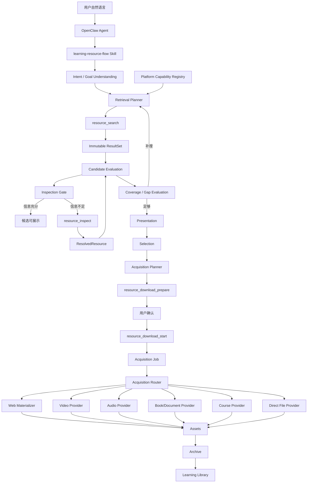
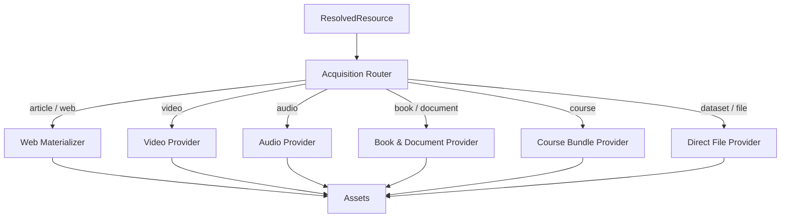

# flow_ver 资源检索系统 v2：总体规划方案与执行计划

> 项目：`lxxalalei/flow_ver`
> 基线分支：`codex/growth-resource-taxonomy-rework`
> 基线提交：`bfc4a1230e08ddc07eb05027fd6cbe92b8e952f6`
> 日期：2026-08-07
> 定位：面向后续 Codex / OpenClaw 实施的主设计文档，不是单一“网页转 HTML”方案。

---

# 执行进度（根智能体维护）

- 总体状态：`blocked`
- 执行开始：2026-08-08
- 当前分支：`codex/growth-resource-taxonomy-rework`
- 当前基线：`bfc4a1230e08ddc07eb05027fd6cbe92b8e952f6`
- 当前阶段：`0023-retrieval-e2e-hardening`
- 编排方式：根智能体负责架构决策、整合和验收；并行子智能体使用 `gpt-5.6-luna`、`reasoning_effort=max`

| 计划 | 状态 | 当前结果 / 下一步 |
|---|---|---|
| 0017 契约与文档收敛 | `completed` | 已统一 `contracts/`、1.0.0、12 tools；修复 catalog/browse 契约漂移，29 项相关测试通过 |
| 0018 Resource Model + Platform Registry | `completed` | private Retrieval、Identity/Dedup、16 平台 Registry、全部 descriptor 与双入口接入已验收；104 项相关测试通过 |
| 0019 Inspection Layer | `completed` | Contract/Storage/Core/7 Inspectors/Service/Skill/Docs 全部完成；109 项合并测试与编译、链接、平台/工具一致性通过 |
| 0020 Adaptive Retrieval Loop | `completed` | SearchDirection/Gap/Stop、migration 4、immutable extend、provenance/coverage、Skill 与 18 个 golden cases 已验收；MCP 回归 279/279 通过 |
| 0021 Acquisition Core + Web Materializer | `completed` | Acquisition Router、静态 Web Fetch/Block IR/Materializer、ZIP primary、Job/Archive 接入已验收；全量本地回归 317/317 通过 |
| 0022 Multimodal Asset Bundle | `completed` | catalog 1.3.0、migration 5、多资产 Job/Bundle、SmartEdu partial、Archive/Library 关系已验收；全量本地回归 348/348 通过 |
| 0023 E2E Hardening | `blocked` | 4/4 真实 stdio 子进程 E2E 与全量 352/352 通过；本机缺少 `openclaw`，doctor/probe 和默认 Agent 完整对话待外部环境 |

当前 0017 的仓库执行记录位于 `.agent/plans/0017-current-contract-and-doc-alignment.md`。
当前 0018 的仓库执行记录位于 `.agent/plans/0018-resource-model-and-platform-registry.md`。
当前 0019 的仓库执行记录位于 `.agent/plans/0019-inspection-layer.md`。
当前 0020 的仓库执行记录位于 `.agent/plans/0020-adaptive-retrieval-loop.md`。
当前 0021 的仓库执行记录位于 `.agent/plans/0021-acquisition-core-and-web-materializer.md`。
当前 0022 的仓库执行记录位于 `.agent/plans/0022-multimodal-asset-bundle.md`。
当前 0023 的仓库执行记录位于 `.agent/plans/0023-retrieval-e2e-hardening.md`。

## 0017 执行日志

- 已核实 `HEAD=bfc4a1230e08ddc07eb05027fd6cbe92b8e952f6`，开始时 Git 工作树干净。
- 已核实机器事实：`contract_version=1.0.0`、`catalog_version=1.0.0`、12 个公共工具，包含 `resource_browse_creator`。
- 已核实公共 `resource_type` 为 `article`、`book`、`document`、`video`、`audio`、`course`、`dataset`、`other`。
- 第一轮并行任务已派发：根级文档、MCP 契约文档、一致性测试、0018 架构预研；写入范围互不重叠。
- 当前机器有 Python 3.14.5，但仓库内没有可用 `.venv`，系统 Python 缺少 `pydantic`，也未发现 `openclaw`；验收时将区分静态检查、隔离依赖测试和无法执行的 OpenClaw 真实回合。
- 架构决策：总体规划和运行时已经采用 `contracts/`、`1.0.0`、12 tools；根 `AGENTS.md` 中仍存在的 `contracts/v2/` 约束属于治理文档漂移，纳入 0017 由根智能体修正。
- 0017 已完成：根级与 MCP 文档已对齐；catalog meta-schema 已修正为 12 tools；`resource_browse_creator` 的 `search_run_id`、本地 `$ref`、平台运行记录和独立幂等范围已修复。
- 0017 根验收：隔离 Python 环境中 29 项相关测试全部通过，`compileall` 和 15 条本地 Markdown 链接检查通过；未执行全量测试、真实平台网络测试或 OpenClaw probe。
- 0018 已启动：只读预研确认内部新增 Retrieval Layer 与 Platform Capability Registry，不修改公共 1.0.0 Schema、SQLite 或 `resource_inspect`。
- 0018 第一轮已并行派发：Resource Model/Identity/Dedup、16 平台 Registry、Adapter 能力事实审计、搜索兼容接入设计；两个代码工作包写入范围互不重叠。

## 0018 执行日志

- 第一轮四个子任务均已交付：内部 Candidate/Identity/Representation 模型与稳定去重、16 平台 Registry/Schema/严格加载器、现有 Adapter 事实审计、搜索兼容接入设计。
- 根智能体复核确认：`generic + 15 adapters` 构成 16 平台；creator browse 仅 Bilibili、Douyin、Zhihu、Weibo；专用下载实现仅覆盖 Bilibili、Douyin、SmartEdu、Ximalaya、Anna's Archive，其余 `webpage` 表示通用获取回退。
- 已记录实现事实：Anna's Archive Adapter 当前由 Libgen 镜像提供检索/下载；Wechat Adapter 当前经 Sogou Weixin 检索；平台注册表与登录态 Session Registry 继续保持分离。
- Registry 5 项相关测试已由根智能体复跑并全部通过；`inspect` 仍全部为 false，Registry 未包含凭据、命令或本地路径。
- Identity/Dedup 首版 22 项测试中发现 2 个必须修复的问题：DOI URL 尚未提升为 DOI 身份、等价 ISBN-10/ISBN-13 尚未合并。已退回原 Luna Max 子智能体修正，不作为已知风险放行。
- DOI/ISBN 修复已交付并由根智能体复跑；随后补齐 NLC 与 Anna/Libgen 具有不同 native ID 但 ISBN 相同的跨平台用例。Identity/Dedup 23 项全部通过，无效 ISBN 校验位不会参与自动合并。
- 根复核发现 Registry 与 Identity 内置 URL profile 存在清理参数漂移，已新增 Luna Max 修正任务，要求 Registry 锁定 Bilibili、Douyin、Zhihu、Ximalaya 的已审计 tracking 参数并与 fallback 一致。
- Registry 漂移已修正并由根智能体验收：7 项 Registry 测试通过；SmartEdu query 继续完整保留，错误平台不能声明其他平台的可清理参数。
- 冻结 `AdapterDescriptor`、Registry 缓存查找和 legacy stub 兼容接口已完成，descriptor/registry 合计 16 项测试通过；15 个内置 Adapter 正按三组互斥文件并行挂载 descriptor。
- 15 个内置 Adapter、generic Bing/SearXNG 后端均已挂载精确 Registry descriptor；内置注册强校验 descriptor，外部/历史测试 stub 仍可只提供 `platform_id`。
- `resource_search` 与 `resource_browse_creator` 已共用服务端规范化与 Identity/Dedup 路径：URL 安全校验和空标题过滤在前，逻辑资源去重及缺失事实补充居中，随机 public `resource_id` 在最终候选生成时创建。
- 根智能体在隔离临时 venv 中运行 0018 相关 Identity、Dedup、Registry、Adapter、Search、Browse、Service、Contract、Control Plane 共 104 项测试，全部通过；系统 Python 曾因缺少 `lxml` 导致 3 项 Anna/Libgen 解析测试失败，隔离依赖环境复跑后已消除。
- 0018 已完成：Registry JSON Schema、`compileall`、Skill 16 平台表一致性、22 条本地 Markdown 链接和 `git diff --check` 均通过；未执行全量测试、真实平台网络测试或 OpenClaw probe。

## 0019 执行日志

- 已完成契约/服务、Inspector/网络安全、持久化/恢复三路 Luna Max 只读预研；根智能体选择首版单资源、固定服务端 profile、严格有界同步检查，避免在尚无状态工具的情况下引入不可恢复的伪异步流程。
- `resource_inspect` 输入冻结为 `contract_version`、`flow_id`、`resource_id`、`idempotency_key`；禁止 URL、路径、批量 ID、depth、Cookie 和 Token。
- 新增工具属于兼容性加法：既有工具 `contract_version` 保持 `1.0.0`，catalog 将升为 `1.1.0` 并精确包含 13 个工具；SQLite 规划前向 migration 3，Resolution 与 ResultSet 快照分表。
- 0019 计划已创建并进入契约工作包；初始平台感知 Inspector 范围为 generic、Bilibili、NLC、Anna/Libgen、Ximalaya、Zhihu、SmartEdu。
- 0019 第一轮已并行派发：第 13 个工具契约/catalog、SQLite migration 3 与 Resolution 原子存储、纯内部 Inspection Core；三个写入范围互不重叠，均使用 Luna Max。
- 契约工作包已交付并通过根验收：catalog `1.1.0` 精确包含 13 个工具，Inspect 输入只允许冻结的四个字段，定向 Schema 测试 4/4 通过；server 尚未注册第 13 个工具是集成前暂态。
- 第一轮持久化执行者已落 migration 3 与 Resolution 存储实现，根智能体复跑迁移测试 4/4 通过；但其专用存储测试未落文件，Inspection Core 执行者也未落文件，因此两个未完成实例已终止，未把运行中状态记作完成。
- 第二轮已重新派发两个更窄的 Luna Max 子任务：一项只补齐 Resolution 原子性、缓存、跨 Flow、并发和敏感字段测试并修正真实缺陷；另一项只实现纯内部 Inspection Core 与无网络测试。两者完成后再并行展开 Generic 与六个平台 Inspector。
- Resolution 存储补测已交付并由根智能体复跑：migration、原子 Resolution/audit/idempotency、replay/conflict、resolved/partial cache、unresolved 重试、跨 Flow、当前 ResultSet 恢复、ResultSet 快照不变、并发与递归敏感字段剥离合计 11/11 通过。
- Inspection Core 已交付并由根智能体复跑 7/7 通过：`InspectionResult` 固定并防御性复制、结果边界有界、source fingerprint 稳定、Router 精确平台分派且无 generic fallback、敏感 locator/凭据/路径与非 JSON 对象被拒绝。
- Platform Registry inspect 能力已交付并由根智能体复跑 23/23 通过：七个平台精确启用、九个平台保持关闭，Schema 与严格 loader 强制 `capabilities.inspect == inspection.supported`，descriptor 自动反映能力。
- Generic Web Inspector 已交付并由根智能体复跑 18/18 通过：resolver/transport 可注入，初始与逐跳重定向执行 SSRF 策略，声明/流式读取均受 1 MiB 上限控制，HTML 与文件 MIME/魔数交叉验证，错误结果不泄漏 URL、路径、响应头、字节或原始异常；未访问真实网络。
- 六个平台 Inspector 已分为 Bilibili/Zhihu/SmartEdu 与 NLC/Anna-Libgen/Ximalaya 两个 Luna Max 写入组并行实现，均复用 Generic 的安全网络边界并使用固定夹具。
- Bilibili/Zhihu/SmartEdu 组已交付并由根智能体复跑 26/26 通过；NLC/Anna-Libgen/Ximalaya 组已交付并由根智能体复跑 26/26 通过。平台域名或 Anna/Libgen MD5 边界、allowlist metadata、主/落地页 Representation、availability 与 failure 状态保留、locator/秘密隔离均有固定夹具覆盖。
- 服务接入工作包已启动：将统一注册七个 Inspector、实现 Flow ownership/幂等/cache、持久化公共输出、flow_status Resolution 恢复和第 13 个 MCP tool。
- 服务接入已交付并由根智能体复跑 30/30 通过：默认 Router 与 Registry 精确一致；跨 Flow/不存在资源等价拒绝；同键 replay/conflict 在网络前生效；resolved/partial 跨键 cache 命中不重复检查；unresolved 新键可重试；并发同键只执行一次；ResultSet 快照不变；flow_status 恢复当前 Resolution；server 已注册第 13 个 `resource_inspect`。
- Skill Inspection Gate 与根/MCP/契约架构文档已按两个 Luna Max 写入组并行派发，完成后由根智能体统一核对总体规划、链接、工具数、平台表和最终测试矩阵。
- 0019 已完成最终根验收：合并相关测试 109/109 通过，`compileall`、23 条本地 Markdown 链接、16 平台 inspect 7 开 9 关、catalog/runtime 13 tools 与 `git diff --check` 均通过；未执行全量测试、真实平台网络或 OpenClaw doctor/probe，未提交、未推送。
- 0020 Adaptive Retrieval Loop 已创建并启动，首先冻结 immutable ResultSet extend、SearchRun provenance、coverage/gap 与停止/重规划语义。
- 0020 第一轮已并行派发三路 Luna Max 只读审计：公共 `resource_search` 兼容形状、Storage/ResultSet immutable extend、领域语言/Skill/golden cases。根智能体使用 domain-modeling 约束 SearchDirection、SearchRound、Coverage、Gap、InformationGain、StopDecision 与 Replan 的术语边界。
- 0020 审计冻结：复用 `resource_search`，旧调用默认 `replace`，`extend` 必须绑定当前 ResultSet；Provider 接口和 `contract_version=1.0.0` 不变，目录版本计划升至 `1.2.0`。Migration 4 仅持久化可恢复、可复算的 SearchRun/ResultSet 事实，不提前暴露 DiscoveryState 工具。
- 0020 已完成：catalog `1.2.0`、migration 4、immutable extend、跨轮 Identity/Dedup、SearchRun provenance、事实 coverage、内部 7 维 Coverage/Gap/Stop evaluator、Skill adaptive loop 与 18 个 golden cases 已落地。根验收 education-resources 本地 MCP 回归 279/279、`compileall`、33 条本地 Markdown 链接和差异检查通过；未执行真实平台网络或 OpenClaw doctor/probe，未提交、未推送。
- 0021 Acquisition Core + Web Materializer 已创建并启动；首轮先并行审计现有 direct downloader、RenderingDownloader、Generic Inspector、Job/Asset/Archive 与静态网页物化的安全复用边界。
- 0021 三路只读审计已由根智能体验收并冻结：不改公共 13 tools、不做 migration；`_run_download_job` 接内部 Router；静态物化优先且浏览器不默认执行；Web bundle 同时生成可单资产归档的 ZIP，正式 Artifact role/bundle 关系留给 0022。
- 0021 首批实现已并行交付：Acquisition 模型/Router 根回归 11/11 通过，并补强认证/策略失败禁止 fallback；逐跳 Web Fetch 安全测试 13/13 通过；Skill、MCP 与当前架构文档已对齐静态优先、显式 browser capture 和 ZIP primary 边界。Generic Web Block IR/Materializer 与服务集成仍在根验收中。
- 0021 已完成根验收：四类网页 golden fixtures、XSS/危险链接、SSRF/redirect、MIME/魔数、同源图片、总量、取消、部分写入清理、静态优先路由、单 ZIP Asset 与 Archive 可移植性均有回归；定向 Acquisition 测试 38/38、服务/控制面 40/40、education-resources 全量本地回归 317/317、`compileall`、24 条相关文档链接、catalog/runtime 13 tools 与差异检查通过。未执行真实网络或 OpenClaw doctor/probe，未提交、未推送。
- 0022 Multimodal Asset Bundle 已创建并启动；第一轮先并行审计当前 Asset/Job/Archive/Library、平台多文件下载、公共 Schema 与领域术语，再冻结最小 migration 和兼容范围。
- 0022 四路只读审计已由根智能体验收并冻结：migration 5 使用 AssetBundle/BundleItem/PartialFailure 权威关系；Job 生命周期状态不新增 partial，而以可选 completion 区分 complete/partial；catalog 计划升至 1.3.0 但仍为 13 tools；Archive 保持 asset-scoped 并通过 BundleItem 恢复关系；旧 Provider 保持兼容，SmartEdu partial 不再丢弃。
- 0022 四路 Luna Max 实现与根集成已完成：migration 5 原子 Bundle/Item/Failure、历史回填、enriched batch envelope、SmartEdu 角色/逐项失败、catalog 1.3.0 可选投影、Service Job/Flow/Archive/Library 接入及 Skill/文档均已落盘。
- 0022 根验收：Bundle Storage/Migration、Acquisition/SmartEdu、跨层 Service、Contract/stdio 与全部历史回归合计 348/348 通过；`contract_version=1.0.0`、13 tools 和 Job 生命周期状态保持兼容。未执行真实平台网络或 OpenClaw doctor/probe，未提交、未推送。
- 0023 E2E Hardening 已创建并启动：先以公开 JSON-RPC stdio 子进程完成跨进程恢复、部分失败、认证恢复、多资源 Acquisition、Archive/Library，再单独处理本机缺少 `openclaw` 的真实环境门槛。
- 0023 本地 E2E 已完成：测试 harness 直接启动 MCP stdio 子进程并发送原始 JSON-RPC，精确发现 13 tools；多资源 Inspect/确认/partial Bundle、书籍 edition、网页 ZIP、逐 Asset Archive/Library、绑定失配和幂等冲突均通过。
- 0023 恢复验收已完成：下载第一个资源后第二个资源阻塞时强杀 MCP 进程，同 SQLite 启动新进程后 Job 明确终结为 failed、ready Asset 被 quarantine、Bundle 关系保留且文件数不增长；没有自动重放网络副作用。
- 0023 认证恢复验收已完成：首个 Job 返回 AUTH_REQUIRED 且无 Asset；外部无秘密 marker 模拟合法 session-manager 会话就绪后，同 Selection 创建新 Plan/Job 并成功归档检索。4/4 E2E 与全量本地回归 352/352、`compileall` 和差异检查通过。
- 0023 当前阻塞：本机 `command -v openclaw` 无结果，常见用户级路径也未发现可执行文件；因此未运行 doctor/probe 和默认 Agent 完整对话，不使用历史 WSL 结果或本地 stdio fixture 冒充真实 OpenClaw 验收。未提交、未推送。

---

# 0. 执行摘要

当前 `flow_ver` 已经不是“几个爬虫脚本”，而是一个初步成型的学习资源控制面：

```text
用户自然语言
  -> OpenClaw
  -> learning-resource-flow Skill
  -> education-resources stdio MCP
       -> 多平台搜索 Adapter
       -> ResultSet
       -> Presentation
       -> Selection
       -> DownloadPlan
       -> Job
       -> Asset
       -> Archive / Library
```

应保留的核心资产：

1. 单一用户入口 Skill。
2. MCP 负责权威状态、副作用、幂等、下载、归档和安全边界。
3. `ResultSet -> Presentation -> Selection` 的严格边界。
4. 下载必须 `prepare -> 用户确认 -> start`。
5. 模型只能提交服务端 ID，不能提交本地路径。
6. SQLite 负责 Flow、Resource、Job、Asset、Archive 等可恢复状态。
7. 平台登录由独立 `session-manager` 管理。
8. 平台 Adapter 已有统一搜索协议。
9. 归档已经具备 `learning-v1` 分类、内容去重和安全目录。

当前真正缺少两块能力：

```text
A. Retrieval Intelligence
   用户想找什么
   -> 应该搜哪些方向
   -> 去哪些平台
   -> 每个平台搜什么
   -> 搜几轮
   -> 哪些候选值得进一步检查
   -> 什么时候已经搜够

B. General Resource Acquisition
   Candidate 到底是什么资源
   -> 是否需要 Inspect
   -> 可以获取哪些 Representation
   -> 用什么 Acquisition Strategy
   -> 生成哪些 Asset
```

因此 v2 的正确定位应为：

> **Learning Resource Retrieval & Acquisition Engine**
> 学习资源发现、评估、解析、获取、实体化与归档引擎。

网页转 HTML 只是其中一个分支：

```text
Article/Web Resource
  -> Web Inspector
  -> Web Materializer
  -> HTML / Markdown / Images / Metadata
```

与它同级的还有：

```text
Video -> MP4 / Subtitle / Cover
Audio -> MP3/M4A / Cover / Transcript
Book  -> EPUB/PDF / Cover / Metadata
Course -> Video + Slides + Worksheet + Metadata
Dataset -> CSV/JSON/ZIP
```

---

# 1. 当前仓库基线

## 1.1 Active 分支

真正代表当前产品状态的是：

```text
codex/growth-resource-taxonomy-rework
```

后续设计、测试和迁移均以该分支为基线，不以 `master` 为当前实现。

## 1.2 Active 结构

```text
skills/
└── learning-resource-flow/
    ├── SKILL.md
    ├── references/
    └── examples/

mcp/
├── education-resources/
│   ├── contracts/
│   ├── src/education_resource_mcp/
│   │   ├── adapters/
│   │   ├── search.py
│   │   ├── service.py
│   │   ├── storage.py
│   │   ├── jobs.py
│   │   ├── downloader.py
│   │   └── policy.py
│   └── tests/
└── session-manager/
```

旧七阶段 Skill 保留在 `legacy/skill-pipeline-v1/`，不应重新恢复为 active 架构。

## 1.3 当前公共 Tool

实际 `contracts/tool-catalog.json`：

```text
contract_version = 1.0.0
catalog_version  = 1.2.0
```

共 13 个 Tool：

```text
resource_flow_start
resource_flow_status
resource_search
resource_presentation_save
resource_selection_save
resource_download_prepare
resource_download_start
resource_job_status
resource_job_cancel
resource_archive
resource_library_search
resource_browse_creator
resource_inspect
```

0017 已完成原有文档漂移修复；0019 新增 `resource_inspect`，0020 以兼容字段扩展
`resource_search` 并把 catalog 升至 `1.2.0`。以后工具事实必须以
`contracts/tool-catalog.json` 为单一来源。

## 1.4 当前系统本来就是多资源类型

现有 `resource_type`：

```text
article
book
document
video
audio
course
dataset
other
```

现有 `preferred_container`：

```text
original
pdf
epub
mp4
mp3
html
text
```

所以无需推翻当前控制面，只需补齐通用 Resource 和 Acquisition 抽象。

---

# 2. 系统重新定位

## 2.1 Resource 不等于 URL

正式定义：

> Resource 是一个具有独立内容价值、可被识别、比较、使用和归档的逻辑内容实体。

例如《小王子》是一个 Book Resource，它可能有：

```text
ISBN
出版社页面
NLC 书目
EPUB
PDF
封面
```

这些不是六个 Resource，而是同一资源的不同 locator / representation / asset。

一个 Bilibili 视频可能产生：

```text
video.mp4
subtitle.srt
cover.jpg
metadata.json
```

它们都是同一个 Video Resource 的 Asset。

## 2.2 生命周期

```text
User Need
  ↓
FlowTask
  ↓
SearchDirection
  ↓
SearchRun
  ↓
CandidateResource
  ↓
ResolvedResource
  ↓
Presentation
  ↓
Selection
  ↓
AcquisitionPlan
  ↓
Job
  ↓
Asset / AssetBundle
  ↓
Archive
```

新增的两个关键抽象：

```text
CandidateResource -> ResolvedResource
Download -> Acquisition / Materialization
```

---

# 3. 核心数据模型

## 3.1 CandidateResource

Candidate 只是“搜索发现的候选”，可以信息不完整。

建议内部结构：

```json
{
  "resource_id": "res_xxx",
  "platform": "bilibili",
  "resource_type": "video",
  "title": "太阳系到底有多大",
  "canonical_url": "https://...",
  "summary": "...",
  "author": "...",
  "published_at": "...",
  "availability": "available",
  "native_identity": {
    "type": "platform_id",
    "value": "BVxxxx"
  },
  "signals": {
    "duration_seconds": 960,
    "platform_metrics": {}
  },
  "resolution_status": "candidate"
}
```

Candidate 只需做到：

- 可定位；
- 可初步判断；
- 可去重；
- 可以继续 Inspect。

## 3.2 ResolvedResource

经过详情接口、网页深读、文件探测等确认后形成。

```json
{
  "resource_id": "res_xxx",
  "resource_type": "video",
  "platform": "bilibili",
  "identity": {
    "native_id": "BVxxxx",
    "isbn": null,
    "doi": null
  },
  "title": "太阳系到底有多大",
  "creator": "...",
  "description": "...",
  "language": "zh-CN",
  "metadata": {
    "published_at": "...",
    "duration_seconds": 960
  },
  "availability": {
    "status": "available",
    "auth_required": false
  },
  "representations": [
    {
      "representation_id": "repr_video",
      "kind": "video",
      "container": "mp4",
      "role": "primary",
      "materializable": true
    },
    {
      "representation_id": "repr_subtitle",
      "kind": "subtitle",
      "container": "srt",
      "role": "companion",
      "materializable": true
    }
  ]
}
```

## 3.3 Representation

Representation 表示“同一逻辑资源可以被获取成什么形式”。

字段建议：

```text
representation_id
kind
container
mime_type
role
language
estimated_size_bytes
availability
materializable
requires_auth
rights_hint
```

`role`：

```text
primary
alternate
subtitle
cover
metadata
attachment
companion
transcript
thumbnail
```

## 3.4 Asset

现有 Asset 已有：

```text
asset_id
resource_id
media_type
size_bytes
sha256
validation_status
```

建议后续增加：

```text
representation_id
asset_role
container
filename
```

形成：

```text
ResolvedResource
  ├── primary Asset
  ├── subtitle Asset
  ├── cover Asset
  └── metadata Asset
```

---

# 4. 目标总体架构



---

# 5. 职责边界

## OpenClaw

负责：

- 会话；
- 模型；
- Skill；
- Tool 调用；
- 面向用户解释；
- 用户确认。

不负责：

- 路径；
- SQLite；
- 网络安全；
- 实际下载；
- 归档事务；
- Cookie/Token；
- 无限搜索循环。

## Skill

负责语义：

```text
理解需求
是否澄清
搜索方向
平台选择
Query 设计
候选审查
是否 Inspect
Coverage / Gap
是否补搜
展示顺序
推荐解释
```

## MCP

负责确定性和权威状态：

```text
Flow
SearchRun
ResultSet
Resource IDs
Presentation
Selection
Plan
Job
Asset
Archive
幂等
安全
恢复
```

核心原则：

> LLM 提供判断，Controller/MCP 约束状态转换。

---

# 6. Retrieval Intelligence

完整循环：

```text
Understand
  ↓
Plan
  ↓
Search
  ↓
Evaluate
  ↓
Inspect?
  ↓
Coverage / Gap
  ↓
够了吗？
  ├─ No -> Replan
  └─ Yes -> Present
```

## 6.1 SearchDirection

Planner 不应直接生成几十个 Query。

先形成 SearchDirection：

```json
{
  "direction_id": "dir_01",
  "purpose": "找到直观讲解太阳系结构的视频或图解",
  "resource_types": ["video", "article"],
  "source_priority": [
    "professional_science",
    "public_education",
    "creator"
  ]
}
```

另一个方向：

```json
{
  "direction_id": "dir_02",
  "purpose": "找到可以继续阅读的中文科普书或电子资料",
  "resource_types": ["book", "document"]
}
```

方向的价值：

- Query 有明确目的；
- 可以判断哪个方向覆盖不足；
- 可以计算补搜收益；
- 不会陷入无限近义词改写。

---

# 7. Platform Capability Registry

把当前 Skill 中的人工平台知识升级成机器可读 Registry。

建议：

```text
mcp/education-resources/contracts/platforms/platform-registry.json
```

示例：

```json
{
  "platform_id": "bilibili",
  "display_name": "哔哩哔哩",
  "capabilities": {
    "search": true,
    "browse_creator": true,
    "inspect": true,
    "acquire": true
  },
  "resource_types": ["video"],
  "source_traits": ["creator", "video", "community"],
  "auth": {
    "mode": "enhanced"
  },
  "search": {
    "recommended_limit": 10,
    "parallel_queries": false
  },
  "acquisition": {
    "strategies": ["platform_video"]
  }
}
```

Planner 路由：

```text
Intent 需要 video
  ↓
Registry 找 search=true + video
  ↓
bilibili / cctv / smartedu / generic
  ↓
模型按任务排序
```

中期 Adapter 应自描述 capabilities，避免 Registry 与代码漂移。

---

# 8. Search Planner 与预算

推荐首轮预算：

```text
Directions:            1–2
Platforms/direction:   2–3
Queries/platform:      1–2
Candidates/query:      5–10
Initial unique pool:   <= 30
```

现有 Schema 的最大值是安全上限，不应成为默认行为。

Planner 示例：

```json
{
  "round": 1,
  "directions": [
    {
      "direction_id": "dir_01",
      "search_tasks": [
        {
          "platform": "bilibili",
          "queries": [{"query": "太阳系 科普 结构"}]
        },
        {
          "platform": "cctv",
          "queries": [{"query": "太阳系 科普"}]
        }
      ]
    }
  ]
}
```

---

# 9. ResultSet 的多轮问题与解决方案

当前 ResultSet 不可变是正确设计。

但多轮搜索会产生：

```text
Round 1 -> ResultSet A
Round 2 -> ResultSet B
```

而 Presentation 只能来自一个 ResultSet，导致无法自然组合两轮的最佳候选。

推荐新增：

```text
resource_search.mode = replace | extend
```

`replace`：

```text
本轮新结果 -> 新 immutable ResultSet
```

`extend`：

```text
当前 ResultSet
+ 本轮新结果
-> 去重
-> 新 immutable ResultSet snapshot
```

例如：

```text
rset_v1 = A B C
rset_v2 = A B C D E
rset_v3 = A B C D E F
```

Presentation 永远引用最新 ResultSet。

建议输入：

```json
{
  "mode": "extend",
  "base_result_set_id": "rset_xxx"
}
```

服务端验证：

- 属于当前 Flow；
- task_version 一致；
- provenance 可追踪；
- 去重后再创建新 snapshot。

---

# 10. 三层去重

必须区分：

```text
Candidate dedup
Resource identity dedup
Asset content dedup
```

Candidate：

```text
canonical URL
native platform ID
```

Resource：

```text
ISBN
DOI
platform native ID
normalized title + creator + edition
```

Asset：

```text
SHA-256 + size
```

不能用同一种规则解决三层问题。

---

# 11. Candidate Evaluation

继续保持当前 `candidate-judgment.md` 的方向：

1. 先硬过滤。
2. 再任务相关比较。
3. 不使用固定一套综合分数适配所有任务。

硬过滤：

```text
明显偏题
违反 must / exclude
不安全
不可定位
失效
空页
纯广告
```

动态评估维度：

```text
relevance
usefulness
substance
authority
usability
availability
diversity
format fit
learning value
```

评分可以用于 telemetry，但不要让固定加权公式替代语义判断。

---

# 12. Inspection Gate

正式替代旧的“要不要进入网页”。

真正的问题是：

> 当前 Candidate 元数据是否足以判断、比较和获取？

必须 Inspect 的情况：

1. 缺少重要元数据。
2. 需要验证硬约束。
3. 资源身份有歧义。
4. 用户准备下载/归档。
5. Generic Search 只返回入口页。
6. 标题摘要不足以判断内容质量。
7. 需要确认具体 representation / format / availability。

可不 Inspect：

- Adapter 已返回充分、可信的详情；
- 用户只是宽泛浏览；
- 当前明确展示为初步候选；
- 不涉及副作用；
- 不需要正文才能判断。

---

# 13. resource_inspect Tool

这是 v2 第一项真正重要的新公共能力。

输入示意：

```json
{
  "flow_id": "...",
  "result_set_id": "...",
  "resource_ids": ["res_xxx"],
  "inspection_depth": "standard"
}
```

depth：

```text
metadata
standard
deep
```

输出：

```json
{
  "resource_id": "...",
  "resolution_status": "resolved",
  "resolved": {
    "title": "...",
    "creator": "...",
    "resource_type": "video",
    "metadata": {},
    "availability": {},
    "representations": []
  },
  "inspection": {
    "method": "platform_api",
    "inspected_at": "...",
    "warnings": []
  }
}
```

安全边界：

```text
只能传当前 Flow 中存在的 resource_id
不能传任意 URL
不能传 Cookie/Token
限制响应大小
限制 Inspect 深度
```

平台 inspect 示例：

```text
Bilibili -> 时长、UP、分P、字幕、可用形式
NLC -> 作者、出版社、ISBN、年份
Anna -> 版本、格式、大小
Ximalaya -> 单集/专辑、主播、时长
Zhihu -> 作者、正文元数据、更新时间
SmartEdu -> 课程目录、附件
Generic Web -> title/content-type/article metadata
```

---

# 14. Coverage / Gap：什么时候搜够

不是“结果数量 >= 20”。

每个 SearchDirection 维护：

```text
unsearched
weak
covered
strong
```

停止条件建议：

```text
1. 无未满足硬约束
2. 有足够可展示候选
3. 每个必要方向已覆盖
4. Top candidates 关键元数据充分
5. 无关键身份/可用性疑问
6. 新一轮高质量新增明显下降
7. 无明确高价值未搜索来源
```

信息增益由代码提供客观统计：

```text
new_candidates
new_unique_resources
new_displayable_candidates
new_source_families
duplicates
```

模型判断新增是否真正有价值。

---

# 15. Retrieval State

短期：

```text
directions
coverage
gaps
queries tried
```

仍可以由 Skill 在当前会话管理。

中期建议持久化 DiscoveryState，否则上下文压缩后只恢复 ResultSet，无法恢复：

> “为什么之前搜过这些平台、当前还缺什么”。

未来可增加：

```text
resource_discovery_state_save
```

但它不是当前第一优先级，不应阻塞 Inspection 和 ResultSet extend。


---

# 16. Acquisition：从“下载”升级为“获取与实体化”

内部模型正式定义为：

```text
Selection
  ↓
AcquisitionPlan
  ↓
AcquisitionJob
  ↓
Materialized Assets
```

公共 API 暂时继续保留：

```text
resource_download_prepare
resource_download_start
```

原因：

- 当前确认、幂等、Plan digest、Job 和恢复边界已经建立；
- 不应为了术语漂亮破坏稳定契约；
- 可以先让内部代码采用 Acquisition 语义；
- 真正需要大版本时再考虑 Tool 重命名。

推荐 `AcquisitionStrategy`：

```text
direct_file
web_capture
web_materialize
platform_video
platform_audio
book_file
course_bundle
repository_snapshot
metadata_only
```

---

# 17. Acquisition Router



Router 输入：

```text
resource_type
platform
resolved representations
preferred_container
auth status
rights hints
max bytes
```

Router 输出：

```text
strategy
provider
representation(s)
expected assets
risk summary
```

---

# 18. Web Materializer

网页 HTML 是 Acquisition Router 下的一种 Materializer，不是系统主流程。

目标不是：

```text
HTTP response -> raw.html
```

而是：

> 把网页型学习资源变成可长期查看、结构清晰、资源引用完整、可检索的本地 representation。

处理流程：

```text
URL
 ↓
HTTP Fetch
 ↓
如必要：Browser Render
 ↓
DOM
 ↓
Content Extraction
 ↓
Sanitize
 ↓
Asset Discovery
 ↓
Download Images / Attachments
 ↓
Rewrite Links
 ↓
Render Local Template
 ↓
Package
```

推荐产物：

```text
resource/
├── index.html
├── content.md
├── metadata.json
└── assets/
    ├── image-001.webp
    ├── image-002.jpg
    └── attachment-001.pdf
```

固定 HTML 模板：

```text
Header
  标题
  作者
  来源
  时间

Body
  正文
  图片
  引用
  表格
  代码
  附件

Footer
  原始 URL
  获取时间
  来源/版权提示
```

不建议保留各网站原始 CSS 作为主渲染样式。

---

# 19. Web Materializer 实现细节

## 19.1 Fetch 策略

默认：

```text
HTTP 优先
```

只有以下情况进入 Browser：

```text
正文由 JS 渲染
HTTP 获取为空壳
关键资源只有浏览器环境才能解析
平台本身已有合法登录态且允许访问
```

禁止：

```text
所有网页默认 Playwright
```

否则成本、稳定性和资源占用都会显著增加。

## 19.2 内容中间模型

不要直接从 DOM 拼字符串。

定义 Block：

```text
heading
paragraph
image
quote
ordered_list
unordered_list
table
code
divider
attachment
embed_placeholder
```

不同网页 Parser 输出统一 Block Tree，再由：

```text
HTML Renderer
Markdown Renderer
```

分别消费。

## 19.3 Sanitization

至少移除：

```text
script
tracking pixels
ads
navigation
cookie banners
unsafe iframe
inline event handlers
```

保留：

```text
语义结构
正文
必要链接
图片
表格
代码
引用
```

## 19.4 图片和附件

所有外链资源必须：

```text
校验 URL
下载
检查大小
验证格式
SHA-256
写 Asset
改写为本地相对引用
```

失败的非关键图片不应导致整个网页任务失败，应返回 warnings。

## 19.5 metadata.json

至少：

```json
{
  "resource_id": "...",
  "source_url": "...",
  "canonical_url": "...",
  "platform": "...",
  "title": "...",
  "author": "...",
  "published_at": "...",
  "captured_at": "...",
  "rights_hint": "...",
  "assets": []
}
```

---

# 20. Video Acquisition

Video Resource 建议支持：

```text
primary video
subtitle
cover
metadata
```

示例：

```text
video.mp4
subtitle.zh.srt
cover.jpg
metadata.json
```

注意：

- 字幕应作为 Asset，不直接塞入模型上下文；
- 用户只要视频时，不应默认产生 ASR；
- 原平台提供字幕时优先保存原字幕；
- 多 P 视频应在 Inspect 阶段先确认结构。

---

# 21. Audio Acquisition

Audio Resource：

```text
audio.mp3 / m4a
cover
metadata
transcript（仅来源存在时）
```

ASR 是派生处理能力，未来可增加：

```text
DerivedAsset
```

但不要把语音转写变成默认下载步骤。

---

# 22. Book / Document Acquisition

Book Inspect 至少确认：

```text
title
author
publisher
ISBN
edition
language
year
available representations
```

核心规则：

> 搜索到的图书介绍网页，不等于已经获得图书资源。

可能存在：

```text
Book Resource
  ├── Locator: NLC catalog page
  ├── Representation: EPUB
  ├── Representation: PDF
  └── Asset: selected EPUB
```

Document Resource 则可能是：

```text
PDF
DOCX
PPTX
TXT
```

需要验证：

```text
真实 MIME
扩展名
文件大小
可访问状态
```

---

# 23. Course Resource

Course 是最不能被“一个 URL / 一个文件”模型限制的资源。

```text
Course Resource
  ├── Video Asset
  ├── Slide Asset
  ├── Worksheet Asset
  ├── Exercise Asset
  └── Metadata Asset
```

当前 `DownloadProvider` 已允许：

```python
DownloadResult | list[DownloadResult]
```

这项能力应保留并上升为正式 `AssetBundle` 概念。

---

# 24. AssetBundle

内部建议：

```json
{
  "bundle_id": "bundle_xxx",
  "resource_id": "res_xxx",
  "assets": [
    {
      "asset_id": "asset_1",
      "role": "primary"
    },
    {
      "asset_id": "asset_2",
      "role": "subtitle"
    }
  ]
}
```

短期不必马上增加：

```text
resource_archive_bundle
```

可以先：

- 一个 Job 产生多个 Asset；
- Asset 都指向同一个 resource_id；
- Archive 层保留关系；
- 等真实场景稳定后再决定是否增加公共 Bundle Tool。

---

# 25. Archive 与资源语义解耦

当前物理目录：

```text
学习资料库/
  <主领域>/
    <主主题>/
      <视频|图文|音频|其他>/
```

短期继续使用。

但必须明确：

```text
Resource Type != Asset Format
```

例如：

```text
Resource Type = book
Representation = epub
Asset MIME = application/epub+zip
```

后续可增加：

```text
material_format_category
```

取值：

```text
video
audio
document
web
image
archive
other
```

归档目录应依据真实 Asset 类型，不应依据 Resource Type 猜测。

---

# 26. 完整 OpenClaw 运行示例

用户：

> 帮我找一些适合小学阶段了解太阳系的中文资源，视频、图文和书都可以，先给我挑几个。

系统：

```text
1. Intent
   topic = 太阳系
   outcome = 直观理解太阳系
   types = video/article/book

2. SearchDirections
   D1 = 直观讲解
   D2 = 深入阅读

3. Platform Router
   D1 -> bilibili / cctv / generic
   D2 -> nlc / annas-archive / generic

4. resource_flow_start

5. Round 1 resource_search

6. ResultSet
   约 20 个 candidate

7. Candidate Evaluation
   去除偏题、重复、低价值

8. Inspection Gate
   Top 8 中需要确认时长/版本/内容的进入 Inspect

9. resource_inspect

10. Coverage
    D1 = strong
    D2 = weak

11. Replan
    只补 D2

12. resource_search(mode=extend)

13. 新 immutable ResultSet snapshot

14. Inspect 新高潜候选

15. Coverage
    D1 strong
    D2 covered/strong

16. 展示最终 5 项

17. resource_presentation_save

18. 用户选择 2、4

19. resource_selection_save

20. resource_download_prepare

21. 用户确认

22. resource_download_start

23. Acquisition Router
    2 -> Video Provider
    4 -> Web Materializer

24. Assets

25. Archive
```

---

# 27. 契约演进策略

原则：

> 不为了概念漂亮立即破坏 v1 已建立的控制面。

## 27.1 1.0.x：内部和文档

不改公共 Schema：

- 文档统一；
- internal Resource Model；
- Platform Registry；
- Acquisition abstraction；
- Adapter descriptor。

## 27.2 1.1.0：向后兼容扩展

优先新增：

```text
resource_inspect
```

再考虑扩展：

```text
resource_search.mode
resource_search.base_result_set_id
```

Candidate optional fields：

```text
native_identity
resolution_status
signals
```

Asset optional fields：

```text
representation_id
asset_role
container
```

## 27.3 2.0.0：真正有必要时

只有下列能力成熟再升级：

```text
DownloadPlan -> AcquisitionPlan
AssetBundle 成为公共契约
DiscoveryState 成为权威状态
Presentation 不再局限传统 ResultSet
Archive 从 Asset 中心升级为 Resource Bundle 中心
```

不要提前做 2.0。

---

# 28. 推荐代码结构

```text
mcp/education-resources/
├── contracts/
│   ├── schemas/
│   ├── taxonomy/
│   ├── platforms/
│   │   └── platform-registry.json
│   └── tool-catalog.json
│
├── src/education_resource_mcp/
│   ├── adapters/
│   │   ├── base.py
│   │   └── ...
│   │
│   ├── retrieval/
│   │   ├── models.py
│   │   ├── registry.py
│   │   ├── identity.py
│   │   ├── dedup.py
│   │   ├── inspection.py
│   │   └── search_runs.py
│   │
│   ├── acquisition/
│   │   ├── models.py
│   │   ├── router.py
│   │   ├── direct_file.py
│   │   ├── web.py
│   │   ├── video.py
│   │   ├── audio.py
│   │   ├── book.py
│   │   └── course.py
│   │
│   ├── server.py
│   ├── service.py
│   ├── storage.py
│   ├── jobs.py
│   └── policy.py
└── tests/
```

但不要一次搬完。

策略：

```text
新逻辑进入 retrieval/ 与 acquisition/
旧 service/downloader 调用新模块
稳定后再减少旧文件职责
```

---

# 29. 实施总路线

建议分为 8 个阶段：

```text
Phase 0  基线与文档收敛
Phase 1  通用 Resource Model
Phase 2  Platform Registry
Phase 3  Inspection Layer
Phase 4  Adaptive Retrieval Loop
Phase 5  Acquisition Architecture
Phase 6  Web Materializer
Phase 7  Multimodal Asset Bundle
Phase 8  E2E Hardening
```

后续 `.agent/plans/` 建议：

```text
0017-current-contract-and-doc-alignment.md
0018-resource-model-and-platform-registry.md
0019-resource-inspection-layer.md
0020-adaptive-retrieval-loop.md
0021-acquisition-core-and-web-materializer.md
0022-multimodal-asset-bundle.md
0023-retrieval-e2e-hardening.md
```

---

# 30. Phase 0：基线与文档收敛

## 目标

先消除代码事实和文档事实差异，不增加业务功能。

## P0-01 当前事实快照

建议生成：

```text
docs/CURRENT_ARCHITECTURE.md
```

至少记录：

```text
branch
commit
contract version
catalog version
tool count
tool names
resource types
adapter list
current tests
```

## P0-02 修正文档

检查：

```text
README.md
docs/DEVELOPMENT_PLAN.md
mcp/education-resources/README.md
skills/learning-resource-flow/*
.agent/plans/*
```

统一为：

```text
contracts/
1.0.0
12 tools
resource_browse_creator
```

## P0-03 机器事实唯一来源

明确：

```text
Tools -> contracts/tool-catalog.json
Resource Types -> common.schema.json
Taxonomy -> taxonomy/learning-v1.json
Platforms -> platform-registry.json（Phase 2）
```

## 验收

```text
旧 contracts/v2 描述无无解释残留
工具列表 == catalog
contract version == 1.0.0
Markdown 本地链接有效
原测试无回归
git diff --check
```

---

# 31. Phase 1：通用 Resource Model

## 目标

正式建立：

```text
Resource != URL
Resource != Asset
```

## P1-01 internal models

新增：

```text
retrieval/models.py
```

包含：

```text
CandidateResourceInternal
ResolvedResource
Representation
ResourceIdentity
```

先不改 public Schema。

## P1-02 统一 Adapter 内部输出

当前 `make_resource()`：

```text
platform
title
source_url
resource_type
summary
metadata
```

逐步增加：

```text
native_identity
signals
canonical_url
```

service 层兼容旧字段。

## P1-03 Identity Resolver

优先级：

```text
platform native ID
ISBN
DOI
canonical URL
normalized fingerprint
```

## P1-04 Asset 增强准备

内部增加：

```text
asset_role
representation_id
container
```

## 验收

```text
同一 BV 不因 URL 参数不同重复
同一 ISBN 可以识别为同一书
canonical URL fragment 不产生重复
一个 Resource 可对应多个 Asset
现有 resource_search 输出兼容
```

---

# 32. Phase 2：Platform Registry

## 目标

让“去哪里搜”从 Prompt 常识升级成系统能力。

## P2-01 Registry Schema

字段：

```text
platform_id
display_name
resource_types
capabilities
auth_mode
source_traits
search config
inspection config
acquisition strategies
```

## P2-02 覆盖当前平台

至少：

```text
generic
bilibili
douyin
zhihu
smartedu
ximalaya
cctv
yixi
kepu
baiduwenku
runoob
nlc
open163
annas-archive
weibo
wechat
```

## P2-03 Registry 与 Adapter 一致性

测试：

```text
每个 active Adapter 必须有 Registry
platform_id 一致
search=true 才能注册 Search Adapter
资源类型必须属于 common schema
```

## P2-04 Skill Reference

生成或同步：

```text
skills/learning-resource-flow/references/platform-capabilities.md
```

避免 Skill 维护第二份冲突事实。

---

# 33. Phase 3：Inspection Layer

## 目标

解决：

> 什么时候进入网页、详情页、API 或文件探测？

## P3-01 Adapter Protocol 新增 inspect

```python
def inspect(resource) -> InspectionResult:
    ...
```

首版检查 profile 由服务端固定为 `inspect-v1`，不接受模型传入 `depth`。Inspect 是 capability，
可选，不要求所有 Adapter 一次支持；未注册平台返回 `FEATURE_NOT_SUPPORTED`，不得静默回落
到 generic。

## P3-02 Generic Web Inspector

首版：

```text
初始 URL、重定向和最终 URL 均执行网络策略，但 locator 不进入输出
title
content type
content length
basic author/date
article metadata
availability
bounded representation metadata
```

先不要把完整 Web Materializer 混进来。

## P3-03 首批平台

优先实现：

```text
bilibili
nlc
annas-archive
ximalaya
zhihu
smartedu
```

它们覆盖：

```text
video
book
audio
article
course
```

## P3-04 resource_inspect Tool

新增：

```text
contract schema
tool catalog
server binding
service
storage
errors
tests
```

严格限制只能 Inspect 当前 Flow 已有 resource_id。

冻结输入：

```text
contract_version
flow_id
resource_id
idempotency_key
```

禁止传入 URL、路径、凭据、批量 ID 或检查深度。

## P3-05 持久化 Resolution

SQLite 建议：

```text
resource_resolutions
```

字段：

```text
resolution_id
flow_id
resource_id
profile_version
source_fingerprint
resolution_status
resolved_json
inspection_json
failures_json
inspected_at
created_at
updated_at
```

## 验收

真实链路：

```text
Search -> Candidate -> Inspect -> ResolvedResource
```

至少覆盖视频、书籍、网页、音频、课程各一个代表 case。

---

# 34. Phase 4：Adaptive Retrieval Loop

## 目标

实现：

```text
Plan -> Search -> Evaluate -> Inspect -> Gap -> Replan
```

## P4-01 SearchRun Provenance

保存：

```text
round
direction_id
platform
query
candidate_count
failure_count
new_unique_count
duplicate_count
```

## P4-02 ResultSet extend

新增：

```text
mode
base_result_set_id
```

仍生成 immutable ResultSet。

## P4-03 Skill SearchDirection

重写 `discovery-strategy.md`：

```text
先目标
-> SearchDirection
-> Resource Type
-> Platform Traits
-> Platform
-> Query
```

## P4-04 Inspection Strategy

新增：

```text
references/inspection-strategy.md
```

明确：

```text
什么时候 Inspect
Inspect top K 的选择方式
什么时候跳过
什么时候必须 Resolve 后才能推荐
```

## P4-05 Retrieval Evaluation

新增：

```text
references/retrieval-evaluation.md
```

定义：

```text
weak / covered / strong
critical gap
marginal gain
stop
replan
```

## P4-06 Semantic Regression

扩展：

```text
examples/semantic-regression-cases.json
```

覆盖：

```text
只找视频
找视频+图书
指定平台
指定格式
结果偏题
结果太少
重复过多
高风险主题
图书版本歧义
网页需要 Inspect
网页无需 Inspect
登录增强平台不足
```

## 验收

建立至少 20 个 Golden Retrieval Tasks。

不要求 Query 字面完全一致，而验证：

```text
方向合理
平台族合理
Inspect 决策合理
补搜行为合理
停止条件合理
```

---

# 35. Phase 5：Acquisition Architecture

## 目标

内部从 Downloader 升级成 Acquisition，同时保持公共 Tool 兼容。

## P5-01 Models

新增：

```text
AcquisitionStrategy
AcquisitionRequest
AcquisitionResult
MaterializedAsset
```

## P5-02 Router

根据：

```text
resource_type
platform
representations
preferred_container
auth
rights
```

路由 Provider。

## P5-03 包装 PublicHttpDownloader

将其职责定义成：

```text
DirectFileAcquirer
```

或由 acquisition/direct_file.py 包装。

## P5-04 Job 内部语义升级

公共仍：

```text
DownloadPlan
```

内部执行记录：

```text
acquisition_strategy
provider
representation
```

## 验收

现有 download tests 全部通过。

新增：

```text
一个 Resource 多 Asset
strategy 路由
不允许任意 strategy
错误 representation 拒绝
```

---

# 36. Phase 6：Web Materializer

## 目标

实现独立、通用、可长期查看的网页资源包。

## P6-01 Fetch

```text
HTTP first
Browser fallback
```

## P6-02 Content Block Model

统一：

```text
heading
paragraph
image
quote
list
table
code
attachment
```

## P6-03 Sanitization

去除不可信和无价值元素。

## P6-04 Asset Discovery

图片、附件本地化。

## P6-05 HTML Renderer

统一本地模板。

## P6-06 Markdown Renderer

生成 `content.md`。

## P6-07 metadata

生成 `metadata.json`。

## P6-08 测试

至少：

```text
古诗文纯文本
知乎长文+图片
博客
表格
代码页
JS 动态页
图片失败
附件 PDF
重定向
超大资源
```

---

# 37. Phase 7：Multimodal Asset Bundle

## P7-01 Asset Role

公共 Schema 增加：

```text
primary
subtitle
cover
metadata
attachment
transcript
companion
```

## P7-02 Bundle

SQLite：

```text
asset_bundles
asset_bundle_items
```

## P7-03 视频

目标：

```text
MP4 + SRT + cover + metadata
```

## P7-04 音频

目标：

```text
audio + cover + metadata
```

## P7-05 图书

目标：

```text
EPUB/PDF + metadata + optional cover
```

## P7-06 课程

目标：

```text
multiple assets
partial failure traceable
bundle relationship retained
```

---

# 38. Phase 8：全链路 Hardening

必须跑通：

## Scenario A：单视频

```text
Intent
-> video direction
-> Bilibili/CCTV
-> Inspect
-> Presentation
-> Selection
-> Download
-> Archive
```

## Scenario B：混合资源

```text
video + article + book
-> multiple directions
-> extend ResultSet
-> Inspect
-> one Presentation
-> multiple Providers
-> Archive
```

## Scenario C：网页 HTML

```text
Search
-> Inspect
-> Web Materializer
-> HTML + MD + images
-> Archive
```

## Scenario D：书籍版本

```text
Search
-> ambiguous editions
-> Inspect
-> select edition
-> EPUB/PDF
```

## Scenario E：恢复

```text
OpenClaw/MCP restart
-> flow_status
-> resume
```

## Scenario F：部分失败

```text
one platform auth_required
one failed
one succeeded
-> ResultSet partial
-> no fake success
-> continue possible
```

---

# 39. 测试体系

## Unit

```text
identity
dedup
registry
inspection
acquisition routing
web extraction
HTML renderer
asset role
```

## Contract

每个 Tool：

```text
input
output
additionalProperties=false
error shape
catalog consistency
```

## Integration

```text
Adapter -> Search
Search -> ResultSet
ResultSet -> Inspect
Inspect -> ResolvedResource
Presentation -> Selection
Selection -> Plan
Plan -> Job
Job -> Assets
Assets -> Archive
```

## Semantic Regression

检查模型：

```text
是否选对搜索方向
是否无脑搜全部平台
是否过度搜索
是否该 Inspect 时没 Inspect
是否滥用 Inspect
是否把未知写成事实
是否把 ResultSet 当 Presentation
```

## Golden Benchmark

建议：

```text
tests/golden_retrieval/
```

Case 不要求固定 Query，要求行为目标：

```json
{
  "request": "...",
  "expected": {
    "resource_types": ["video"],
    "required_source_traits": [],
    "inspection_required": true,
    "min_displayable": 3
  }
}
```

---

# 40. 观测指标

Retrieval telemetry：

```text
search_rounds
queries_used
platforms_used
candidates_total
candidates_unique
candidates_displayable
duplicate_rate
inspection_count
inspection_success_rate
result_set_growth
new_displayable_per_round
```

Acquisition：

```text
acquisition_prepare_success
job_success_rate
asset_validation_failure
archive_success_rate
```

用户体验：

```text
first-round-displayable rate
average search rounds
selection rate
confirmation rate
successful archive rate
```

---

# 41. 安全边界

继续保持：

```text
模型不提交文件路径
模型不提交 shell
模型不提交 Cookie/Token
不绕验证码
不绕付费墙
不绕 DRM
SSRF 防护
重定向重检
大小限制
真实格式验证
```

新增 `resource_inspect` 后必须特别约束：

```text
Inspect(resource_id)
```

而不是：

```text
Inspect(url)
```

即：

> 模型只能让服务端检查已进入当前 Flow 的资源，不能把 Inspect 变成任意网络访问工具。

---

# 42. 迁移原则

## 不大爆炸重构

禁止一次 PR 同时重写：

```text
search.py
service.py
storage.py
downloader.py
archive
all adapters
all schemas
```

## 每阶段可回滚

采用：

```text
新增
-> 测试
-> 接入
-> 再缩减旧职责
```

## 公共契约最后动

先：

```text
internal model
```

后：

```text
public schema
```

---

# 43. 推荐计划文件拆分

当前 `.agent/plans/` 已到 `0016`。

建议：

```text
0017-current-contract-and-doc-alignment.md
0018-resource-model-and-platform-registry.md
0019-resource-inspection-layer.md
0020-adaptive-retrieval-loop.md
0021-acquisition-core-and-web-materializer.md
0022-multimodal-asset-bundle.md
0023-retrieval-e2e-hardening.md
```

---

# 44. 0017：当前契约与文档收敛

这是下一次 Codex 应首先执行的任务。

范围：

```text
只修事实
不增加功能
```

必须完成：

```text
contract=1.0.0
catalog=1.0.0
tools=12
resource_browse_creator 已记录
contracts/ 路径统一
README / DEVELOPMENT_PLAN / MCP README 一致
```

建议提交：

```text
docs: align active contract and tool catalog
test: add documentation/catalog consistency checks
```

验收：

```text
现有 Python tests
schema self-check
Markdown links
git diff --check
```

---

# 45. 0018：Resource Model + Platform Registry

范围严格限制：

```text
Resource Identity
Candidate internal model
ResolvedResource model
Representation model
Platform Registry
Adapter descriptor
Candidate dedup
```

不要同时实现 Inspect Tool。

建议提交顺序：

```text
1. test: define resource identity cases
2. core: add retrieval models
3. core: add identity resolver
4. contracts: add platform registry schema/data
5. adapters: expose descriptors
6. test: enforce registry-adapter consistency
7. docs: document resource model
```

验收：

```text
现有 search output 不破坏
全部 Adapter 有 descriptor
重复识别行为稳定
Registry schema 通过
```

---

# 46. 0019：Inspection Layer

这是第一项真正新增的公共业务能力。

提交顺序：

```text
1. contracts: add resource_inspect
2. storage: add resolution persistence
3. core: add inspection service
4. adapters: generic inspector
5. adapters: bilibili/nlc/annas/ximalaya/zhihu/smartedu
6. server: expose tool
7. skill: add inspection-strategy
8. tests: contract + integration + security
9. docs
```

关键验收：

```text
不能 Inspect 不属于当前 Flow 的 resource_id
不能传 URL
Inspect 可恢复
重复 Inspect 幂等/缓存策略明确
不同资源类型能得到可比较 metadata
```

---

# 47. 0020：Adaptive Retrieval Loop

目标：

> 让系统真正知道“为什么继续搜、补什么、什么时候停”。

实施：

```text
SearchDirection
SearchRun provenance
ResultSet extend
Coverage / Gap
Information Gain
Stop / Replan
Golden retrieval benchmark
```

提交顺序：

```text
1. storage: search run provenance
2. contracts: extend search input
3. core: immutable ResultSet extension
4. skill: SearchDirection planning
5. skill: coverage/gap evaluation
6. tests: resultset snapshots
7. tests: semantic golden cases
8. docs
```

---

# 48. 0021：Acquisition Core + Web Materializer

先抽象，再写网页。

提交：

```text
1. core: acquisition models
2. core: acquisition router
3. core: wrap direct downloader
4. web: generic inspector integration
5. web: block extraction
6. web: sanitizer
7. web: asset downloader
8. web: html renderer
9. web: markdown renderer
10. web: metadata output
11. tests
12. docs
```

不要一开始就支持所有复杂站点。

第一批目标：

```text
普通文章
古诗文页面
知乎式长文
普通图文博客
```

---

# 49. 0022：Multimodal Asset Bundle

实施：

```text
Asset Role
AssetBundle internal model
video companion assets
audio companion assets
book metadata/cover
course multi-assets
archive relation
```

只有真实使用证明需要时，再新增 bundle 级 Tool。

---

# 50. 0023：E2E Hardening

验收必须在真实 OpenClaw + MCP 中执行，而不仅是 Python unit tests。

要求：

```text
MCP doctor/probe
完整对话
重启恢复
部分失败
认证暂停/恢复
多资源 Acquisition
Archive
Library Search
```

---

# 51. 每阶段 Git 提交策略

推荐小提交：

```text
docs:
test:
contracts:
storage:
core:
adapter:
skill:
```

例如 0019：

```text
contracts: define resource inspect protocol
storage: persist resource resolutions
core: implement inspection service
adapters: add first inspection providers
skill: add inspection decision rules
test: cover inspection security and recovery
docs: document resource inspection
```

避免一个 commit 数千行、多个层混在一起。

---

# 52. 立即执行优先级

如果现在开始开发：

```text
P0  0017 文档/契约事实统一
P1  0018 Resource Model + Registry
P2  0019 Inspection
P3  0020 Adaptive Retrieval
P4  0021 Acquisition + Web Materializer
P5  0022 Multimodal Bundle
P6  0023 E2E
```

---

# 53. 暂时不要做

当前不建议：

1. 立刻把所有 `resource_download_*` 重命名。
2. 直接发布 contract 2.0。
3. 一次性重构全部 Adapter。
4. 每个平台暴露独立 MCP Tool。
5. 所有网页默认 Playwright。
6. 把 HTML 当统一资源格式。
7. 固定一个适用于所有任务的 Candidate 综合评分公式。
8. 把 Planner、Evaluator 拆成多个独立 Agent。
9. 先引入复杂向量数据库。
10. 先做完整多租户生产架构。

---

# 54. Codex 执行纪律

每个 Plan 开始前：

```text
1. 读取 AGENTS.md
2. 读取当前对应 .agent plan
3. git status --short --branch
4. 确认当前 branch
5. 阅读当前契约和相关实现
6. 先跑可运行 baseline
```

执行中：

```text
不创建未要求的分支
不静默删除旧能力
不修改 legacy 作为 active 依赖
不把历史文档当当前事实
不绕过测试
```

完成后：

```text
compile
unit tests
targeted tests
schema tests
markdown link checks
git diff --check
git status
```

Plan 必须写真实验证结果，不能复制历史“通过”。

---

# 55. Definition of Done

整个 v2 第一阶段成熟的标准：

1. 用户不需要自己指定平台。
2. 用户不需要自己设计搜索词。
3. 系统不会无脑搜索所有平台。
4. 系统能针对缺口补搜。
5. 系统知道什么时候应 Inspect。
6. 系统能解释为什么搜索已经足够。
7. ResultSet 多轮累积仍保持不可变快照。
8. 网页、视频、音频、图书使用同一控制面。
9. 一个 Resource 可以有多个 Representation 和 Asset。
10. 网页 HTML 是 Web Materializer 产物，而不是系统统一格式。
11. 下载执行仍受用户确认和服务端安全策略约束。
12. OpenClaw/MCP 重启后关键业务状态可恢复。

---

# 56. 最终目标

用户只需要表达：

```text
“帮我找一些太阳系的学习资料。”
```

系统完成：

```text
理解目标
 ↓
生成 SearchDirection
 ↓
按 Platform Registry 选择来源
 ↓
生成平台化 Query
 ↓
Search
 ↓
Dedup
 ↓
Evaluate
 ↓
Inspect 高潜候选
 ↓
Coverage / Gap
 ↓
有针对性补搜
 ↓
Stop
 ↓
Presentation
 ↓
Selection
 ↓
Acquisition Router
 ↓
网页 -> HTML/MD/Assets
视频 -> MP4/SRT/Cover
音频 -> MP3/Cover
图书 -> EPUB/PDF
课程 -> AssetBundle
 ↓
Archive
 ↓
Learning Library
```

系统的核心竞争力将不再是：

> 有多少个平台爬虫。

而是：

> **能不能正确理解资源需求、选择合适来源、形成高质量搜索闭环，并把不同形态的资源安全地变成统一可管理的本地资产。**

---

# 57. 最终执行结论

当前正确推进顺序：

```text
契约事实统一
  ↓
Resource Model
  ↓
Platform Registry
  ↓
Inspection Layer
  ↓
Adaptive Retrieval
  ↓
Acquisition Core
  ↓
Web Materializer
  ↓
Video / Audio / Book / Course Bundle
  ↓
E2E Hardening
```

其中：

```text
Inspection + Adaptive Retrieval
```

决定：

> 搜得好不好。

而：

```text
Acquisition + Materializers
```

决定：

> 找到后能不能真正拿下来、验证、保存和归档。

两部分合并后，才是完整的 Resource Retrieval Agent。
